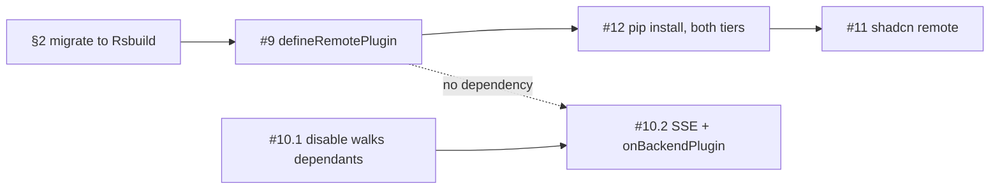

# ⚛️ Reactor — plan for `feat/federation`

Covers the four open roadmap issues:

| Issue | Title | Roadmap page |
| --- | --- | --- |
| [#9](https://github.com/datalayer/reactor/issues/9) | Support Extension Loading via Federation | [/roadmap/federation](./docs/docs/roadmap/federation.md) |
| [#10](https://github.com/datalayer/reactor/issues/10) | Activation/Deactivation should carry to dependants (cross front/backend also) | [/roadmap/cross-tier-activation](./docs/docs/roadmap/cross-tier-activation.md) |
| [#11](https://github.com/datalayer/reactor/issues/11) | Add `shadcn/ui` examples | [/roadmap/shadcn-ui](./docs/docs/roadmap/shadcn-ui.md) |
| [#12](https://github.com/datalayer/reactor/issues/12) | Package + load a frontend+backend extension as a Python package | [/roadmap/python-packaged-extensions](./docs/docs/roadmap/python-packaged-extensions.md) |

This document is the working plan. The roadmap pages are the *public* statement
of the problem; this is how we intend to solve it, in what order, and what has
to be decided before we can.

---

## 1. The one idea that carries all four

Reactor already separates **what a plugin says** from **what it does**. A
manifest is readable without running anything — which is why a plugin can be
listed, described, drawn on the graph and switched off while its code has never
been fetched (`src/core/plugin.ts`, `LazyPluginRef`).

Every one of these four issues is that same split pushed one step further out:

```
today          the manifest is in the shell's bundle, the module is a dynamic import
#9             the manifest is in the shell, the module is on another origin
#12            the manifest comes from the server, the module comes with the wheel
#10            the manifest's cross-tier declarations become live, not just drawable
#11            the manifest says nothing about a UI kit, and we prove it
```

**The consequence for the plan: the core runtime barely changes.** `load` is
already an opaque thunk returning a plugin. A federated plugin is a
`defineLazyPlugin` whose `load` calls the Module Federation runtime instead of
`import()`. Ordering, activation events, failure isolation, disable/enable and
the graph all work already. Resist any design that needs a second kind of
plugin.

---

## 2. Bundler: Rsbuild + Rspack, everywhere

**Decided.** Module Federation is a core architectural requirement for this
project, so the answer is the one [#9](https://github.com/datalayer/reactor/issues/9)
already reached: Rsbuild on Rspack, and we migrate the repository to it rather
than run two toolchains.

Why it wins on the thing we are actually building:

- **First-class MF.** `moduleFederation.options` with no extra plugin
  ([Rsbuild docs](https://rsbuild.rs/guide/advanced/module-federation)), plus
  MF2 dynamic type hints across remotes and hot updates for consumed remotes.
- **Vite's weak half is the half we need.** There, only the host supports dev
  mode: a remote must be produced with `vite build` to emit its `remoteEntry.js`
  ([module-federation.io](https://module-federation.io/integrations/build-tool/vite.html)),
  and consumed-remote hot updates are still roadmap. Plugin authors are the
  people this project exists to serve, and that is their inner loop.
- **One toolchain to document.** A plugin author reads one config, not a
  decision tree.

Rsbuild rather than raw Rspack, for the reason the issue gives: it is the
Vite-like application layer — defaults, dev server, framework plugins — where
Rspack is the bundler underneath, analogous to using webpack directly.

### 2.1 What migrates

| Target | Today | After | Notes |
| --- | --- | --- | --- |
| `examples/frontend` | Vite 5 | Rsbuild | smallest; migrate first as the template |
| `examples/frontend-backend` | Vite 5 | Rsbuild | same shape, plus the backend gate |
| `examples/music/app` | Vite 5 | Rsbuild | the hard one — see below |
| `examples/music/*-plugin` | no build (TSX source) | unchanged, until one becomes a remote | source aliasing moves to `resolve.alias` |
| `plugins/graph`, `plugins/manager` | `tsc` to `lib/` | unchanged | libraries, not bundles — no bundler involved |
| `src/` (the runtime) | `tsc` to `lib/` | unchanged | ditto, and it must stay bundler-free |
| `docs/` | Docusaurus (webpack) | Docusaurus on Rspack | one flag: `future.experimental_faster.rspackBundler` |

Two things that do **not** move, and should not:

- **`@datalayer/reactor` itself gains no bundler dependency.** It loads remotes
  through `@module-federation/runtime`, the standalone SDK
  ([MF 2.0](https://github.com/module-federation/core/discussions/2397)) — which
  is what Rspack's own MF plugin uses underneath. That keeps `registerRemotes()`
  available for remotes the shell never knew at build time, which is the whole
  marketplace story, and keeps the runtime consumable by a host that is on
  something else.
- **`tsc` stays the build for libraries.** Only applications and remotes are
  bundled.

### 2.2 The music app is the one with teeth

Everything else is a small config swap. `examples/music/app/vite.config.ts`
carries four things that need real equivalents:

| Vite config does | Rsbuild equivalent |
| --- | --- |
| aliases the seven `@datalayer-examples/reactor-music-*` packages to `src/index.tsx` | `resolve.alias` — same idea |
| `dedupe: [react, react-dom, @primer/react, styled-components, zustand]` | `resolve.dedupe` / `alias` to one copy, and later the MF `shared` set |
| rewrites `?text` → `?raw` and `*.raw.css`, strips webpack-style `~` | Rspack is webpack-compatible, so `~` needs no strip; the `?raw` rules become loader rules |
| `define: { global, process.env, __webpack_public_path__ }` | `source.define` — and `__webpack_public_path__` stops being a lie |

`docs/docusaurus.config.js` aliases the *same* sources for the embedded demo, so
its `resolve.alias` block and the music app's should end up sharing one exported
constant rather than drifting. Do that in the same commit.

### 2.3 Migration order, and the gate — **done**

1. `examples/frontend` — prove the Rsbuild baseline (React, TS, dev server).
2. `examples/music/app` — prove the four hard cases in §2.2.
3. `docs/` — flip `rspackBundler`, rebuild, re-run the Playwright checks that
   already cover the embedded demo.
4. Only then §3: add Module Federation on top of a toolchain that already works.

**Gate before starting §3** — the migration is done when:

- [x] every example builds and dev-serves on Rsbuild, with no Vite left in the
      repository except in a lockfile
- [x] the music store behaves identically: catalog loads, cart updates, the lazy
      `@music/mood` plugin still arrives via `onContributionPoint`, both tiers'
      switches work — all seven checks, against a real uvicorn
- [x] `docs/` builds on Rspack (`future.faster.rspackBundler`) and the embedded
      demo passes the existing browser checks in both colour schemes
- [x] one React, one `@datalayer/reactor` — `REACTOR_SHARED_MODULES` plus a
      load-time check that names what a host forgot to publish

Three things learned in the doing, recorded because the next app to move will
hit them:

| Surprise | What it was | What to do |
| --- | --- | --- |
| Rsbuild's `dedupe` broke Primer | it aliases the bare specifier, which swallows `@primer/react/experimental` | dedupe only packages nothing imports by subpath; let workspace hoisting do the rest |
| `Module not found: fs` from a Next.js internal | Vite dropped node builtins silently; Rspack asks | `resolve.fallback: { fs: false, … }` — a module needing `fs` in a browser bundle was never going to work |
| two `@rsbuild/core` copies | the reactor repo has its own `node_modules` *and* is a workspace of the outer monorepo, so npm nested a second copy | declare the version the monorepo already resolves, and delete the nested tree |

Two Vite rewrites turned out to be **unnecessary** on Rspack, which is worth
knowing: `*.raw.css` and `?text` become `type: 'asset/source'` module rules, and
webpack-style `~` prefixes need no stripping at all.

## 3. #9 — Federation

### Phase 9.1 — `defineRemotePlugin` (core) — **done**, ESM loader; MF swap open

New file `src/core/remote.ts`, exported from `src/index.ts`.

```ts
export interface RemotePluginRef extends Omit<LazyPluginRef, 'load'> {
  remote: {
    /** The remote container's name, as its manifest declares it. */
    name: string;
    /** URL of its `mf-manifest.json`. */
    entry: string;
    /** The exposed module path, e.g. './plugin'. */
    module: string;
    /** Refused politely if it does not satisfy the host. */
    apiVersion?: string;
  };
}

export function defineRemotePlugin(ref: RemotePluginRef): LazyPluginRef;
```

It returns a `LazyPluginRef` whose `load` registers the remote and calls
`loadRemote`. **That is the whole integration** — the rest of the runtime does
not learn a new concept.

- [x] `defineRemotePlugin` + `registerReactorRemotes(remotes)` for the runtime
      registration path
- [x] `apiVersion` check against a host-declared version, refusing with a
      manifest-visible reason rather than a thrown module
- [x] an allowlist of remote origins on the platform, defaulting to
      same-origin; loading from an origin not on it is refused and *said*
- [ ] `PluginManifest` gains `remote?: {name, entry, module}` so a host can
      draw where a plugin came from, and the [graph](./plugins/graph) a column
      for it — *open; `loadError` landed instead, being the state that actually
      needed showing first*
- [x] tests in `src/core/__tests__/remote.test.ts`: mocked `loadRemote`,
      covering success, failure isolation, version refusal, and StrictMode's
      start/stop/start over one load

### Phase 9.2 — the shared-singleton policy — **done**

The failure mode here is not subtle and not recoverable at runtime: two Reacts.

- [x] write down the singleton set — `react`, `react-dom`, `@datalayer/reactor`,
      `@datalayer/reactor/react`, plus the host's design system — as one exported
      constant consumed by the build preset and asserted by a runtime check that
      warns loudly when a remote brought its own
- [x] a shared Rsbuild config (`@datalayer/reactor-build`) emits it, so a plugin
      package gets the policy by using the preset rather than by copying it

### Phase 9.3 — `examples/federation/` — **done**

A shell and two remotes, deliberately minimal (this is not the music store):
one remote that works, one that is broken on purpose, and a button that
registers a third at runtime from a URL typed into a box. That last one is the
demo that proves a marketplace is possible.

Built, and it earned its keep immediately: drawing the plugin list showed that a
failed remote had no way to say *why* — 9.1 had promised "refused politely, with
the reason on its manifest" and the manifest carried no such field. `loadError`
is now on `PluginManifest`, and the example shows it. A demo that only exercised
the happy path would not have found that.

- [x] `PluginManifest.loadError`, so "installed but unloadable" is a state a
      host can draw rather than an absence somebody has to guess about
- [x] `reactor.install(input)` — add a plugin to a platform that is already
      running, ordered against the plugins already in it, without restarting
      them. This is what a marketplace needs and what `buildReactorFromPlugins`
      could never provide

---

## 4. #10 — Activation and deactivation should carry to dependants

Two independent halves. **Do the first now; it needs no transport and no
bundler.**

### Phase 10.1 — within one tier (a real bug, small fix) — **done**

`deactivate()` already stands dependants down transitively, on both tiers
(`src/core/reactor.ts` `deactivatePlugin`, `reactor/reactor.py`
`deactivate_plugin` → `_dependants_of`). **`disable()` does not**
(`src/core/reactor.ts:928`) — it stops exactly one plugin and leaves its
dependants running against an output nobody maintains.

- [x] `disable(name)` stands dependants down first, transitively, in the same
      order `deactivate` uses
- [x] `enable(name)` brings back the dependants *it* stood down, and only
      those — a dependant somebody disabled by hand stays disabled. Requires
      recording *why* a plugin is down: `disabledBy: 'user' | 'dependency'`
- [x] the same on the Python tier for `disable_plugin` / `enable_plugin`
- [x] the [plugins manager](./plugins/manager) shows a dependency-disabled row
      differently from a user-disabled one, because they are not the same fact
- [x] tests: a three-deep chain, disable in the middle, enable, and the mixed
      case where the top was independently disabled

### Phase 10.2 — across the wire — **done**

The vocabulary already exists on both tiers; **what is missing is a transport,
not a concept.** Do not invent cross-tier lifecycle rules — express it as
events, which is what the model already is.

- [x] `GET /events/stream` (SSE) on `create_reactor_app`, emitting what
      `fire_event` and the toggles already return:
      `{"activated": [...], "deactivated": [...], "enabled": [...], "disabled": [...]}`
- [x] `onBackendPlugin(name)` activation-event helper in `src/core/activation.ts`,
      alongside `onView` / `onCommand` — a convention, not a closed set
- [x] a React binding (`useBackendPluginStream(url)`) that consumes the stream
      and, per change, fires the event or calls `reactor.deactivate` for
      plugins declaring the backend plugin in `requiredBackendPlugins`
- [x] **preserve the three states.** A server event must never revive a plugin
      a person disabled in the browser, and vice versa. This is the invariant
      most likely to be broken by a convenient shortcut; make it a test
- [x] **unreachable ≠ said no.** A dropped stream keeps the last known state and
      marks it stale. Tearing plugins down because a network blip happened would
      be the same mistake as a backend refusing to start because no browser had
      loaded yet
- [x] direction: server→browser propagates. Browser→server does **not** cascade
      deactivation — the server serves many browsers, and one tab closing a view
      is not a reason to stand a plugin down for everyone. Say so in the docs

---

## 5. #12 — One `pip install`, both tiers

The requirement, stated so it can be tested:

> A Python distribution ships both a Python plugin and its JavaScript UI. A
> server application discovers it by installing it. The browser gets a UI with
> that plugin in it. And installing a **new** extension while the server is
> running makes it appear on the next browser refresh — no restart.

That last sentence is the hard one, and it is what the rest of this section is
shaped around.

### 5.1 The distribution layout

JupyterLab's proven shape, not a new one:

```
reactor-extension-hello/
  pyproject.toml
  hello_extension/
    __init__.py                             # the entry point callable
    plugin.py                               # the Python plugin
  share/datalayer/reactor/extensions/hello/
    index.js                                # the built frontend, in the wheel
```

```toml
[project.entry-points."datalayer.reactor.extensions"]
hello = "hello_extension:extension"

[tool.hatch.build.targets.wheel.shared-data]
"share/datalayer/reactor/extensions/hello" = "share/datalayer/reactor/extensions/hello"
```

The entry point resolves to a zero-argument callable returning one
`ReactorExtension` — the two halves, declared together:

```python
def extension() -> ReactorExtension:
    return ReactorExtension(
        manifest=ExtensionManifest(name="hello", display_name="Hello", emoji="👋"),
        plugins=[(HELLO_MANIFEST, HelloPlugin())],      # the Python half
        frontend=FrontendExtension(                     # the JavaScript half
            entry="index.js",
            directory=Path(__file__).parent.parent / "share/...",
            plugins=[FrontendPlugin(name="@hello/panel", display_name="Hello", ...)],
        ),
    )
```

`discover()` already registers `(manifest, implementation)` pairs from an
entry-point group (`reactor/reactor.py:501`). This widens that, it does not
replace it.

### 5.2 Why the frontend plugins are declared in Python

Because the shell must be able to **list, describe and switch off a plugin
whose JavaScript has never been fetched** — the same manifest/entry-point split
the runtime already rests on, now spanning the wire. `FrontendPlugin` carries
exactly what `LazyPluginRef` needs before its module: name, presentation,
dependencies, activation events, `requiredBackendPlugins`. The `entry` is the
module.

Consequence: a plugin list is complete on first paint, and a remote that is
installed-but-unloadable (version refused, origin not allowed) is a *shown*
state rather than an unexplained absence.

### 5.3 Discovery that survives a running server

Three things break naively, and all three have to be handled or "install while
running" does not work:

| Breaks | Why | Fix |
| --- | --- | --- |
| `entry_points()` misses the new distribution | `importlib.metadata` caches the path finder's directory listing | `importlib.invalidate_caches()` before each scan |
| the new package will not import | site-packages listing is cached by `FileFinder` | same call — it clears both |
| static files 404 | `StaticFiles` mounts are fixed at startup | **do not mount per extension.** One route resolves the directory per request |

So: `PluginPlatform.rescan_extensions(group)` is idempotent and cheap, returns
`{"added": [...], "removed": [...]}`, and **the browser triggers it** — the
frontend-extensions endpoint rescans before answering. A refresh is the reload.

- [x] `reactor/extensions.py`: `FrontendPlugin`, `FrontendExtension`,
      `ReactorExtension`
- [x] `PluginPlatform.discover_extensions(group)` / `rescan_extensions(group)`,
      registering both halves; re-registration of an already-known extension is
      a no-op, not an error
- [x] `GET /plugins/frontend-extensions` — rescans, then answers with one record
      per extension: its presentation, `api_version`, the URL of its entry, and
      every frontend plugin's manifest
- [x] `GET /reactor-extensions/{name}/{path}` — resolves per request from the
      live registry, refuses path traversal, serves `.js` as
      `text/javascript`
- [x] uninstall while running: the extension leaves the list and its plugins are
      unregistered. The Python module stays imported — that is unavoidable in
      one process, and is documented rather than pretended away

### 5.4 The shell half

- [x] `src/core/remote.ts`: `defineRemotePlugin(ref)` — a `LazyPluginRef` whose
      `load` fetches a module from a URL instead of a bundled `import()`
- [x] `bootstrapExtensions(backendUrl)`: fetch `/plugins/frontend-extensions`,
      turn each `FrontendPlugin` into a remote ref, hand them to
      `buildReactorFromPlugins`
- [x] **shared singletons, interim.** Until the Rsbuild migration brings MF's
      `shared`, the host publishes its copies on one global
      (`globalThis.__DATALAYER_REACTOR__`) and a remote reads them from there.
      This is what MF does, by hand, and it is ~20 lines — but it is a stopgap
      and the plan says so out loud. `defineRemotePlugin` takes a `loader`, so
      swapping `import(url)` for `loadRemote()` is one function, not a rewrite
- [x] `apiVersion` refused politely: the plugin stays listed with the reason on
      its manifest, rather than throwing during a render
- [ ] version coupling: the two halves ship in one wheel, so a mismatch is a
      packaging bug — fail loudly, unlike `frontend_requirements`, which can
      only ever ask

### 5.5 The proof — **done**, verified against a running uvicorn

`examples/extension/` — a real distribution, installable with `pip install -e`,
that adds a panel to the music store's sidebar.

The acceptance test is a script, not a paragraph:

```bash
uvicorn datalayer_music_example.app:app --port 8799      # already running
pip install -e examples/extension               # while it runs
# refresh the browser → the Hello panel is there, and so is its Python plugin
```

- [x] `examples/extension/` with both halves and no build step, so the chain is
      testable before the Rsbuild migration lands
- [x] a pytest that installs a fixture distribution into a temp `sys.path`
      entry mid-test and asserts the endpoint's answer changes
- [ ] `examples/extension-template/` once the shape has stopped moving — the
      real test of this issue is whether somebody outside the repo can do it

## 6. The host: a Reactor application you can `pip install`

§5 made an *extension* installable. This makes the **application** installable:

> `pip install datalayer_music_example` and run `datalayer-music-example`. A
> FastAPI server comes up serving the built UI *and* the plugins — both tiers,
> one command, no npm and no separate static host.

### 6.1 Why this is a construct and not a script

Every Reactor backend so far has written the same twenty lines: build a
platform, register plugins, `create_reactor_app`, mount routers, then leave the
frontend to somebody else. That last part is the gap. A plugin platform whose
UI has to be deployed separately is not something a person can install — and
"install it and run it" is the whole claim of
[#12](https://github.com/datalayer/reactor/issues/12), one level up.

So the base application becomes a construct of its own.

**On the name.** The obvious word is *shell*, and it is the wrong one twice
over: in this repository the shell is already the browser-side container that
mounts plugins, and in a terminal it means something else again. The
documentation has consistently used **host** for "the application that runs
plugins" — `create_reactor_app` serves a host's management API, `provide_cli`
extends a host, a *host* decides what an octicon id draws. So:
`create_reactor_host`. It names the thing the vocabulary already had a word for.

### 6.2 `create_reactor_host` — **done**

```python
from reactor import PluginPlatform, create_reactor_host

app = create_reactor_host(
    platform,
    ui=Path(...) ,                 # a built single-page UI, or None for API-only
    title="Reactor Music",
    discover=True,                 # scan the entry-point group on boot
)
```

It is `create_reactor_app` plus the two things every host was writing by hand:

- [x] **serve a built UI**, with single-page fallback — unknown paths return
      `index.html` so a client-side route survives a refresh, while every API
      path keeps priority. Getting that ordering wrong is the classic way an
      API starts answering with HTML
- [x] **discover extensions on boot**, so an installed extension is present from
      the first request rather than only after a browser asks
- [x] `run_reactor_host(app, host, port)` — the uvicorn call a console script
      needs, in one place rather than in every example
- [x] `ui=None` stays API-only, because a backend-for-frontend is still a host

### 6.3 `datalayer_music_example` — **done**

`examples/music/backend` becomes a real distribution.

```
examples/music/backend/
  pyproject.toml                       # name = datalayer_music_example
  datalayer_music_example/
    __init__.py
    host.py                            # composes the platform, serves the UI
    __main__.py                        # python -m datalayer_music_example
  share/datalayer/reactor/apps/music/  # the built UI, in the wheel
```

```toml
[project.scripts]
datalayer-music-example = "datalayer_music_example:main"
```

- [x] the four plugin packages become dependencies, so one `pip install` brings
      every plugin — they stay separate distributions because that is the lesson
      (a plugin is its own installable), and this is the host that composes them
- [x] the built UI travels in the wheel under `share/`, the same convention
      §5.1 uses for an extension's frontend
- [x] a source checkout falls back to `examples/music/app/dist`, so
      `pip install -e` plus `npm run build` is a working development loop
- [x] `--port`, `--host`, `--no-ui` and `--reload` on the console script; a host
      that cannot be pointed at a different port is not installable in practice
- [x] the UI it serves must reach the API on **its own origin**, not
      `localhost:8799` — which the frontend currently hard-codes. Same-origin is
      what makes one command work

### 6.4 What this replaces

One thing the build found, worth keeping: a catch-all route does not only answer
paths nobody claimed — it answers the ones that *nearly* matched. A GET to a
POST-only endpoint, or a mistyped plugin name, came back as `index.html`, and a
client expecting JSON fails parsing HTML with no idea why. `mount_reactor_ui`
now collects the first path segment of everything already registered and refuses
to serve the interface under any of them. The scan has to recurse: FastAPI 0.141
does not flatten an included router into `app.routes`, so a plugin's own routes
live a level down — and missing them fails silently, which is the worst way for
this particular thing to fail.


The four-terminal dance in the README — build reactor, pip install five
packages, start uvicorn, start vite — becomes one install and one command. The
long way stays documented, because it is what a *developer* does; the short way
is what everybody else does.

## 7. #11 — shadcn/ui — **done**, by a different route

The plan said "the same store, on a second design system". What was built is a
**different application** on shadcn/ui — `examples/cms` — and it is a better
answer to the same question, for a reason worth writing down.

Porting the music store would have proved that *these plugins* can be redrawn.
What actually needed proving is that a plugin need not know what kit the host
uses at all. The CMS proves it two ways at once:

- almost every contribution is a plain record — a label and a function — so the
  question never arises;
- the one plugin that *does* draw (the AI assistant) borrows the host's kit
  through `setReactorSharedModules`, and inherits its theme without importing
  anything.

So the claim is not "plugins avoid the design system" — some must draw — but
**the kit is something the host hands over**. The same plugin shape works in a
Primer host and a shadcn one, which is what the two examples now show side by
side.

- [x] 7.1 the headless split — `catalog-core`, the data contract with no design
      system in it
- [x] 7.2 a shadcn/ui application: `examples/cms`, on Rsbuild + Tailwind v4 with
      shadcn components owned rather than installed
- [x] the awkward cases named rather than avoided: a plugin **cannot** ship
      Tailwind classes, because Tailwind generates CSS by scanning source at
      build time and a class that only exists in a runtime module is a class
      nobody generated. Publishing the components is the way out
- [x] the manifest gains no `uiKit` hint. The plan leaned *no* until a host
      asked, and building it did not produce a host that asked
- [x] embedded on the docs site at `/examples/cms/demo`, with a **package
      manager**: the button runs the equivalent of `pip install cms-pro` against
      an in-browser host, and a refresh brings three plugins into three points
      that already existed. Two findings came out of embedding it:
      Tailwind's Preflight is a *global* reset and cannot go on a shared page,
      so the demo imports theme and utilities and not the third part — and a
      reset written **outside a cascade layer beats every Tailwind utility**,
      which is why Preflight lives in `@layer base` and why the demo's did too
      before it rendered correctly

### 7.3 And the packaging question it answers

`examples/cms` is also the sharpest statement of the model this project is
built on, which is why it has two Python packages:

```
Python package → Extension → Plugin → Contribution → Contribution point
cms              Core        Gallery  a content type  cms.contentType
cms-pro          Pro         Product  a content type  cms.contentType
```

There is no plugin API for paid plugins. `cms-pro` advertises itself under the
same entry-point group, registers on the same platform, and fills the same
point ids; what makes it paid is who may download the wheel. **Packaging and
licensing sit at the top of that chain and the extension mechanism sits at the
bottom, and nothing in between knows which package paid for what.**

Three points, three shapes, so that "contribution point" is not read as "list of
buttons": the toolbar draws every contribution, content types draw one, and the
publish lifecycle *runs* them and lets any one veto. The SEO validator refuses a
publish; the social publisher only announces one. Both fill the same point.

## 7.4 Review fixes

Six defects found in review of the branch, each fixed with a test:

| Where | What was wrong |
| --- | --- |
| `unregister_plugin` | bumped the revision *before* the lookup, so asking about a plugin that does not exist woke every SSE client to say nothing had happened |
| `rescan_extensions` | remembered a failed load as hopeless. The commonest failure is an entry point advertised before its module is importable — an install still in flight — so the extension stayed invisible until a restart |
| `assertAllowed` | treated `//evil.example/x.js` as a local path. It is *protocol-relative*, and the browser loads it cross-origin: the check now resolves the URL against the page rather than pattern-matching it |
| `useBackendPluginStream` | built `${backendUrl}/...`, so a trailing slash produced `//plugins/state` — one URL in two forms, in every log and cache key downstream |
| `setBackendPlugins` | never cleared its revive list when a plugin was stood down for some *other* reason, so a server coming back could undo a deactivation it had nothing to do with |
| `cms` / `datalayer_music_example` packaging | setuptools' `data-files` copies files, not directories — and a built interface is `index.html` beside `static/`. The wheels did not build at all. Both are on hatchling's `shared-data` now |

The last one is why `make all` exists: it built the wheels, and they failed. A
target that installs everything is a test of the packaging that no unit test was
going to be.

## 8. Sequencing



| Milestone | Contains | Gate |
| --- | --- | --- |
| **M0** ✅ | §2.1–2.3 — everything on Rsbuild | the four boxes in §2.3 |
| **M1** ✅ | 9.1, 9.2, 10.1 | a remote plugin loads in `examples/federation`; disable cascades |
| **M2** ✅ | 9.3, 10.2 | runtime `registerRemotes`; a backend toggle stands a frontend plugin down |
| **M3** ✅ | 5.1–5.5 | `pip install` an extension into the music backend and it appears in the browser |
| **M4** ✅ | 6.1–6.4 — the installable host | `pip install` the music example and `datalayer-music-example` serves the store, both tiers, one command |
| **M5** ✅ | 7.1–7.3 | `examples/cms`: two Python packages, free and paid, filling the same three points on shadcn/ui |

**10.1 has no dependencies on any of this and fixes a real bug — start there
while the migration runs.**

---

## 9. Risks and open questions

| Risk | Why it bites | Mitigation |
| --- | --- | --- |
| Two Reacts across the boundary | hooks throw, and the error names none of this | singleton set as one constant + a runtime identity assertion (9.2) |
| Trust: a remote runs in the shell's origin | a marketplace listing is not a security boundary | origin allowlist first; write down what a listing must assert before we ship anything marketplace-shaped |
| SSE keeps a connection this project never needed | one more thing to operate | keep it optional — polling stays correct, the stream is an optimisation |
| Cross-tier cascade overriding a person's checkbox | silently undoes a deliberate act | the three-state invariant as a test, not a convention |
| Migrating six working configs before writing a line of federation | pure cost until §3 lands; a subtle regression is invisible for weeks | migrate smallest-first, and gate on the music store behaving *identically* (§2.3) rather than merely building |
| `docs/` aliases `examples/music` **sources** | a headless split (11.1) or a remote build changes what the docs site compiles | one exported alias constant shared with the music app (§2.2); the docs build is the canary and it is already in CI |
| Docusaurus on Rspack is behind an `experimental_faster` flag | a Docusaurus upgrade could move it | it is one flag, and webpack remains the fallback — revert costs a line |

### Open questions

1. Does `mf-manifest.json` go in the wheel, or does the server generate it from
   what it discovers? (Wheel is simpler; generated allows a dev-server swap
   without a rebuild.)
2. Should a remote's plugins be *listed* by the server even when the browser
   refuses to load them (version mismatch, origin not allowed)? **Probably yes**
   — a plugin that is installed but unloadable is a state worth showing, and
   hiding it makes an unexplainable absence.
3. Does the Python tier need `activation_events` fired by the *browser*
   (`POST /events/{event}` exists) to count for cross-tier activation, or is
   that a footgun for a multi-tenant server?

---

## 10. Documentation to move as each lands

Each roadmap page is written to state a problem and what is missing. When a
milestone lands, its page moves out of `/roadmap/` and becomes a real page —
and the roadmap index row goes with it. Do not leave a shipped feature
described as planned.

| Lands | `docs/docs/roadmap/…` → |
| --- | --- |
| M1–M2 | `federation.md` → `typescript/federation.md`, linked from `typescript/lazy-loading.md` |
| M2 | `cross-tier-activation.md` → folded into `cross-tier/declaring-dependencies.md` and `typescript/deactivation.md` |
| M3 | `python-packaged-extensions.md` → `python/packaging.md` |
| M4 | a new `python/host.md`, and the music example's README rewritten around one command |
| M5 | `shadcn-ui.md` → `examples/cms` |
