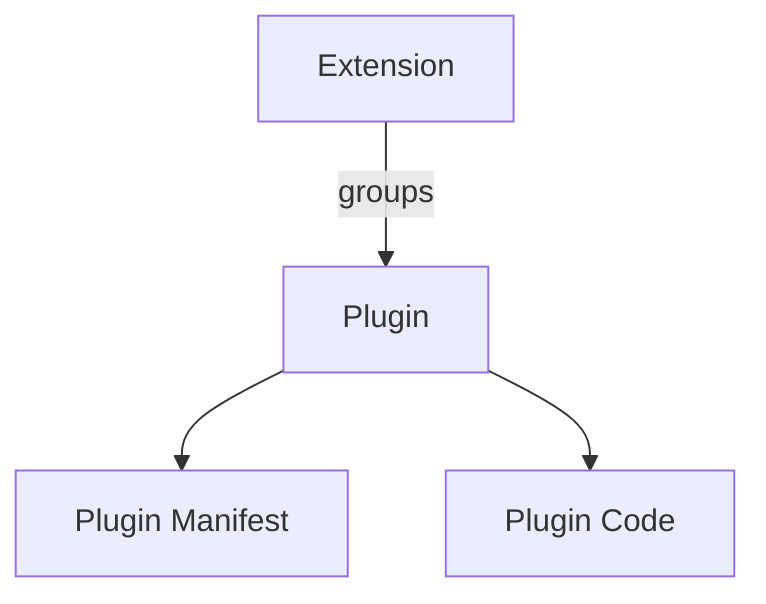
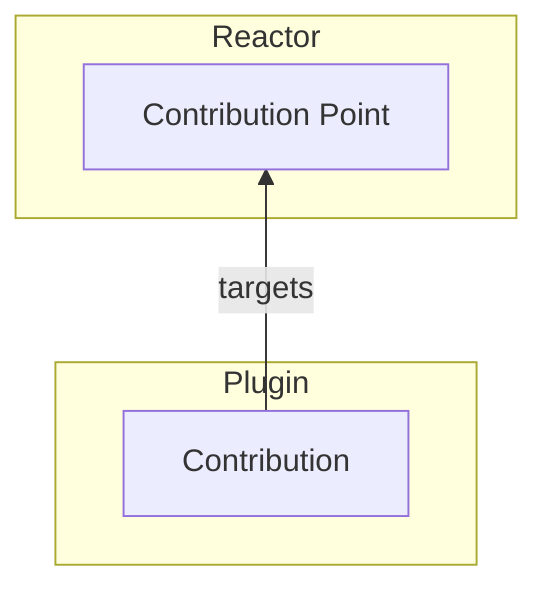
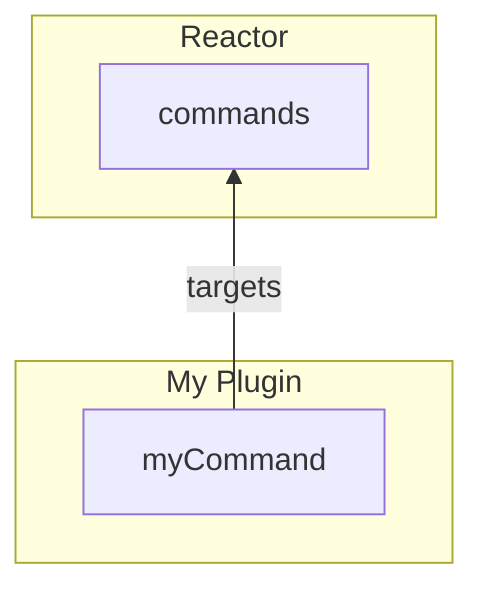
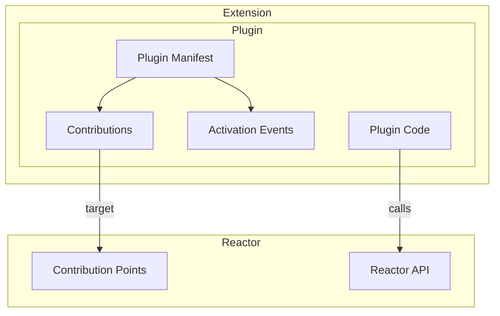
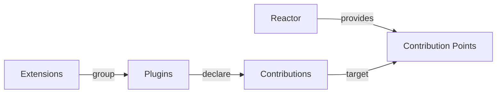

[](https://datalayer.io)

[](https://github.com/sponsors/datalayer)

# 🌀 Reactor

Build extensible frontend (JavaScript) and backend (Python) with a dependency injection solution inpsired by VS Code, Eclipse (OSGI) and other historical solutions.

> 📖 **[reactor.datalayer.tech](https://reactor.datalayer.tech)** — the full
> documentation, with the [music example running in the page](https://reactor.datalayer.tech/examples/music/demo).
> Source in [`docs/`](./docs).

Reactor provides two sibling packages:

- `@datalayer/reactor` (TypeScript): Plugin runtime with a framework-agnostic core and separate React integration.
- `datalayer_reactor` (PyPI distribution, imported as `reactor`): FastAPI + pluggy plugin reactor for modular extensibility.

Both tiers implement the same architecture, described next. That is the point of writing it down once: a host that lists, describes, groups or draws plugins should never have to ask which side of the wire one came from.0

## Why Reactor

This project targets a full plugin platform, not only hook callbacks:

- Platform architecture with lifecycle phases and dependency graph
- Plugin marketplace metadata and discovery primitives
- Third-party ecosystem support through explicit manifest contracts
- Dynamic feature loading and runtime enable/disable
- Modular app concerns: interdependencies, lifecycle management, compatibility checks
- SaaS extensibility primitives: tenant-specific plugin activation, sandboxed execution, versioned compatibility

## Architecture

### Constructs

| Construct              | Purpose                                                   | Relationship                                                         |
| ---------------------- | --------------------------------------------------------- | -------------------------------------------------------------------- |
| **Plugin**             | Fundamental modular and installable unit                  | Declares Contributions and can provide executable code               |
| **Plugin Manifest**    | Describes the Plugin                                      | Contains metadata, contributions, activation rules, and entry points |
| **Contribution Point** | Defines a type of functionality that can be extended      | Provided by Reactor                                                  |
| **Contribution**       | Concrete functionality added through a Contribution Point | Declared by a Plugin                                                 |
| **Activation Event**   | Defines when a Plugin becomes active                      | Triggered by Reactor or by use of contributed functionality          |
| **Reactor API**        | Programmatic API available to Plugins                     | Lets Plugins interact with and extend Reactor                        |
| **Extension**          | Groups related Plugins                                    | Provides a higher-level installable capability                       |

### 1. Packaging

An extension is a wrapper. Everything that has a lifecycle is a plugin, and a
plugin is a manifest plus the code the manifest describes.



### 2. Declarative extensibility

The arrow points one way. Reactor provides the contribution point; a plugin
targets it. Nothing on the Reactor side names the plugin, which is what lets a
plugin be added, removed or replaced without the host knowing.



For example:



### 3. Complete model

The manifest is where the two halves meet: its contributions reach out to the
points Reactor provides, and its activation events say when the code behind
them should start.



Core mental model:



### What each construct is, in this codebase

| Construct | TypeScript | Python |
| --- | --- | --- |
| Plugin | `definePlugin`, `defineLazyPlugin` | `PluginManifest` + implementation |
| Plugin Manifest | `reactor.getManifest(name)` → `PluginManifest` | `PluginManifest` |
| Contribution Point | `defineContributionPoint`, `defineGate` | `define_contribution_point` |
| Contribution | `contribution(...)`, `ctx.contribute(...)` | `contributions.contribute(...)` |
| Activation Event | `activationEvents` / `deactivationEvents`, `reactor.fire(event)`, `reactor.deactivate(name)` | `activation_events` / `deactivation_events`, `platform.fire_event(event)`, `platform.deactivate_plugin(name)` |
| Reactor API | `ctx.reactor` (`ReactorPlatformView`) | `PluginPlatform` |
| Extension | `defineExtension({ plugins })` | `ExtensionManifest` + `register_extension` |

Two distinctions this model rests on, both easy to lose:

**A plugin is the unit of function; an extension is the unit of delivery.** An
extension has no lifecycle, contributes nothing, and cannot be enabled or
disabled. Registering one registers its plugins and records the grouping on
each plugin's manifest — after that, the platform deals only in plugins.
Grouping tells a reader *what to uninstall to lose this*; it never tells the
platform what a plugin may do. An extension that could contribute or be
disabled would be a second kind of plugin, and then every question the reactor
answers would have two answers.

**A manifest is readable without running anything.** That is what lets a plugin
be listed, described, drawn on the graph and switched off while its code has
never been fetched — and it is why activation events are worth having at all.

## Repository Layout

- `src/`: TypeScript package source for `@datalayer/reactor`
- `reactor/`: Python package source
- `examples/`: Various demos

## TypeScript Package `@datalayer/reactor`

### Design

The TypeScript runtime implements:

- `definePlugin`, `defineLazyPlugin` and `configurePlugin`
- `defineExtension`, to group plugins into one installable capability
- `dependencies`, `peerDependencies`, `conflictsWith`
- ordered phases: `init` -> `build` -> `register` -> `afterRegistration`
- runtime lifecycle control: `start`, `stop`, `enable`, `disable`
- contribution points and contributions: `defineContributionPoint`, `contribution`,
	`ctx.contribute`, `reactor.getContributions`
- activation and deactivation events: `activationEvents`,
	`deactivationEvents`, `reactor.fire`, `reactor.deactivate`,
	`onContributionPoint`, `onView`, `onCommand`
- signal primitives for reactive plugin outputs:
	- `signal`, `computed`, `effect`, `batch`, `untracked`
	- `namedSignals`, `watchedSignal`

### Core vs React split

- Core runtime exports from `@datalayer/reactor`
- React bindings export from `@datalayer/reactor/react`

React bindings include:

- `useReactor`: register the reactor in the zustand store and manage its lifecycle
- `ReactorSlot`: render plugin-provided components by named slot
- `useReactorPlatform`: reactor access for runtime toggles
- `useContributions`: subscribe to a contribution point
- `ReactorViewHost`: render the one contribution the application chose
- `ReactorLazy`: a lazily-loaded component with Suspense and an error boundary
- `usePluginManifests` / `useExtensionManifests` / `useGroupedPluginManifests`:
	the plugin list, flat or grouped by the extension that delivered it
- `useReactorEvent`: fire an event when a value changes — activating and
	deactivating whatever was waiting on it

### Slots or contribution points?

Both let a plugin add something. They answer different questions.

**A slot** answers "render everything plugins put here" — a header, a toolbar, a
status bar. Every contribution is rendered, the application does not choose, and
the plugin supplies a component.

**An contribution point** answers "what do plugins *offer*, so the application can
choose?" — a set of views of which one is on screen, commands of which one is
invoked, mention namespaces resolved on demand. Contributions are typed records
rather than components, the application enumerates them and decides, and a record
can carry anything: a title, an icon, an ordering, a lazy module.

Reach for a slot when everything contributed should appear. Reach for an
contribution point when something has to pick.

```ts
import { defineContributionPoint, contribution, definePlugin } from '@datalayer/reactor';

type ViewType = {
	title: string;
	load: () => Promise<{ default: React.ComponentType }>;
};

export const ViewTypePoint = defineContributionPoint<ViewType>('app.viewType');

export const NotebookPlugin = definePlugin({
	name: '@app/notebook',
	// Declarative: resolved during the register phase.
	contributes: [
		contribution(
			ViewTypePoint,
			{ title: 'Notebook', load: () => import('./NotebookView') },
			{ id: 'notebook', order: 10 },
		),
	],
	// Imperative: for contributions that depend on build output, or that appear
	// later. Returns a disposer.
	register(ctx) {
		if (ctx.reactor.hasPlugin('@app/sandbox')) {
			ctx.contribute(ViewTypePoint, { title: 'Sandbox', load: () => import('./SandboxView') }, { id: 'sandbox' });
		}
	},
});
```

```tsx
import { ReactorViewHost } from '@datalayer/reactor/react';

<ReactorViewHost
	point={ViewTypePoint}
	active={activeViewType}
	props={{ workspace }}
	fallback={<Spinner />}
	empty={<EmptyState />}
/>;
```

Contributions are ordered by `order` and then by contribution order, and they are
disposed with the plugin that made them: disabling a plugin removes its views
from the switcher without the application tracking anything.

Enablement rules stay in the application. The reactor stores records and hands
them back; whether a view *may* be opened right now — a notebook that needs a
running kernel — is a question about your domain, not about the platform.

### How a plugin presents itself

`name` is an identifier: `@app/notebook` is what other plugins depend on and
what a dependency graph is drawn from. It is not what a person should be shown.
Four optional fields say that instead — and the same four exist on the Python
`PluginManifest`, so a host listing both tiers never has to ask which side a
plugin came from.

```ts
definePlugin({
	name: '@app/notebook',
	displayName: 'Notebook',
	description: 'Runs notebooks, and owns the kernel they run on.',
	octicon: 'book',      // an id, not a component
	emoji: '📓',
});
```

The icon is named rather than imported on purpose. A component could only come
from the tier that imported it; an id is a string a Python manifest can carry
too, and the host decides what it draws — which is the only place that decision
belongs.

Read it back with `getManifest`, or in React with `usePluginManifests()`:

```ts
reactor.getManifest('@app/notebook');
// { name, displayName: 'Notebook', description, octicon, emoji, version,
//   requiredBackendPlugins: [], optionalBackendPlugins: [], lazy, loaded }
```

Nothing here is required. A plugin that says none of it still runs, and
`displayName` falls back to `name`, so a host always has something to print.

### Turning plugins on and off at runtime

`enable` and `disable` are not restart-only switches. Disabling a plugin
disposes everything it contributed, and any host reading through
`useContributions` or `ReactorSlot` updates immediately — a view leaves the
switcher, a command leaves the palette, without the application tracking
anything.

```ts
reactor.disable('@app/notebook');
reactor.getContributions(ViewTypePoint); // the notebook view is gone
reactor.enable('@app/notebook');
reactor.getContributions(ViewTypePoint); // and back
```

This is what makes a plugin checkbox honest: the list of plugins comes from
`reactor.listPlugins()`, the state from `reactor.isEnabled(name)`, and the UI
that follows is one `useSyncExternalStore` away.

```tsx
function PluginToggles() {
	const reactor = useReactorPlatform();
	useSyncExternalStore(reactor.subscribe, reactor.getRevision);

	return (
		<ul>
			{reactor.listPlugins().map(name => (
				<li key={name}>
					<label>
						<input
							type="checkbox"
							checked={reactor.isEnabled(name)}
							onChange={event =>
								event.target.checked ? reactor.enable(name) : reactor.disable(name)
							}
						/>
						{name}
					</label>
				</li>
			))}
		</ul>
	);
}
```

**Plugins that own something say so.** `enable()` re-runs `init` and `build`,
which is right for a plugin that only contributes records — it comes back
clean. It is wrong for one that owns a connection, a kernel or a cache: the
fresh build returns a new instance while everything holding the previous one is
quietly detached.

```ts
definePlugin({
	name: '@app/sandbox',
	preserveOutput: true,   // keep what I built across disable/enable
	build() {
		return { sandbox: createSandboxService() };   // a live connection
	},
});
```

With `preserveOutput`, enabling a plugin that has already built keeps its
output and only re-runs `register` — so its contributions come back while the
thing it owns stays where it was. A stateless plugin needs none of this and
can be toggled freely.

### Declaring what a Plugin needs from the other tier

A plugin usually has a counterpart across the wire, and there are two strengths
of that relationship: one it cannot work without, and one it does more with.
Both are declared rather than discovered, so a host can draw the relationship
before anything has loaded.

**Frontend → backend.** A required backend plugin gates rendering: while it is
absent or switched off, the plugin's slot components do not render. An
optional one never gates anything — reacting to it is the plugin's own job.

```ts
definePlugin({
	name: '@app/notebook',
	requiredBackendPlugins: ['kernels'],   // no kernels, no notebook
	optionalBackendPlugins: ['search'],    // nicer with it, fine without
});
```

```tsx
function NotebookToolbar() {
	// A required plugin is guaranteed by the time this runs. An optional one
	// is a question, and this is how it is asked.
	const canSearch = useBackendPlugin('search');
	return canSearch ? <SearchButton /> : null;
}
```

**Backend → frontend.** The mirror image, on the `PluginManifest`:

```python
PluginManifest(
    name="checkout",
    version="1.0.0",
    frontend_dependencies=["@app/checkout"],           # required
    optional_frontend_dependencies=["@app/header"],    # nice to have
)
```

These are **declared, not enforced**, and the difference is deliberate. Backend
`dependencies` are checked at registration and refused outright. A frontend
dependency cannot be: the plugins live in a browser the platform cannot see,
and a backend that refused to start because nobody had opened a page yet would
be refusing for the wrong reason. So the platform answers for a caller that
*can* see both sides:

```python
platform.frontend_requirements(["@app/checkout"])
# {"checkout": {"required": ["@app/checkout"], "optional": ["@app/header"],
#               "missing_required": [], "missing_optional": ["@app/header"]}}
```

The same answer is served at `GET /plugins/frontend-requirements?active=…`,
which is how a frontend asks "is anything the server needs missing from what I
loaded?".

### Loading plugins lazily

Laziness happens at two levels, and they are worth keeping apart because they
defer different things.

**A lazy plugin** defers its *module* — the code, and everything that code
imports. **A lazy contribution** defers one *component* while the plugin that
offers it is already up. Most applications want both: the plugin arrives early
enough to appear in a menu, and the heavy view behind the menu entry arrives
when somebody picks it.

#### Lazy plugins

`defineLazyPlugin` declares a plugin whose module is fetched *after* the
platform has started.

```ts
const HeavyPlugin = defineLazyPlugin({
	name: '@app/heavy',
	displayName: 'Heavy',
	octicon: 'package',
	dependencies: [BasePlugin],
	load: () => import('./heavy'),
});

const reactor = buildReactorFromPlugins([HeavyPlugin]);
reactor.start();          // returns as soon as the eager plugins registered
await reactor.whenReady(); // only if you need the rest — tests usually do
```

`start()` activates everything already loaded and returns. Modules are then
fetched **in parallel** and activated **in dependency order**: one slow module
must not hold up the others' downloads, but a dependant must never activate
before what it depends on. Each activation is its own change, so a UI fills in
plugin by plugin rather than in one late jump.

What a host needs before the code arrives is declared on the reference rather
than inside the module — the name, the dependencies, the backend plugins, the
presentation. That is the manifest/entry-point split made concrete, and it is
what lets a plugin list be complete from the first frame instead of growing as
modules land:

```ts
reactor.getManifest('@app/heavy'); // → { displayName: 'Heavy', lazy: true, loaded: false, … }
```

**Lazy plus an activation event is the useful combination.** On its own, a lazy
plugin is fetched right after `start()` — off the critical path, but still
fetched on every page load. Add an activation event and it is not fetched at
all until something asks:

```ts
defineLazyPlugin({
	name: '@app/notebook-toolbar',
	displayName: 'Notebook toolbar',
	activationEvents: [onContributionPoint(NotebookToolbar)],
	load: () => import('./plugin'),
});
```

A session where nobody opens a notebook never downloads it, and it is listed,
described, drawn on the graph and switchable the whole time.

| you want | declare |
| --- | --- |
| up before the first paint | a plain plugin |
| off the critical path, but always loaded | `defineLazyPlugin`, no activation events |
| not loaded unless it is wanted | `defineLazyPlugin` + `activationEvents` |

#### Lazy contributions

A contribution can carry a module thunk instead of a component, so the plugin's
own entry stays light while its view is deferred:

```ts
contribution(ViewType, {
	title: 'Notebook',
	load: () => import('./NotebookView'),   // fetched when the view is chosen
});
```

`ReactorViewHost` and `ReactorLazy` render these with Suspense and an error
boundary, so a slow module shows a fallback and a failed one shows an error
rather than a blank panel:

```tsx
<ReactorViewHost point={ViewType} active={activeViewType} fallback={<Spinner />} />
```

**Keep the entry point light.** The rule that makes all of this pay: anything a
plugin's `index` imports lands in the shell's bundle, however lazy the plugin's
views are. A plugin whose manifest file imports a charting library has already
spent the money. Put the manifest in `index.ts`, the code in a module it
`load`s.

#### Lazy loading on the Python tier

There is no module on the wire, so the deferral is *construction*: register a
`factory` instead of an implementation, and the object is not built until an
activation event fires.

```python
platform.register_plugin(
    PluginManifest(name="reports", version="1.0.0", activation_events=[on_command("report")]),
    factory=lambda: ReportsPlugin(),      # not called yet
)
```

Discovery is lazy in the same spirit: `platform.discover(group)` registers
whatever is advertised under an entry-point group, so installing a distribution
publishes its plugins and nothing is hardcoded in the host.

A few properties worth knowing:

| Situation | What happens |
| --- | --- |
| a module fails to load | that plugin is missing; `whenReady()` still resolves and everything else carries on |
| `disable()` before the module lands | it loads but does not activate; `enable()` activates it once it is there |
| `start()` twice over one load | one fetch, one activation — React StrictMode's start/stop/start is exactly this |
| the module says less than the reference | the reference fills in the gaps; what the module says always wins |
| a plugin is deactivated and reactivated | one fetch — the module is kept, only the phases run again |

### Grouping plugins into an extension

A capability is rarely one plugin. A notebook is an editor, a toolbar, a set of
commands — and nobody wants to install four things to get one, or to read a
plugin list where those four sit at the same level as everything else.

```ts
export const NotebookExtension = defineExtension({
	name: '@app/notebooks',
	displayName: 'Notebooks',
	description: 'The editor, its toolbar, and the commands that drive them.',
	emoji: '📓',
	plugins: [NotebookEditorPlugin, NotebookToolbarPlugin, NotebookCommandsPlugin],
});

const reactor = buildReactorFromPlugins([NotebookExtension, ShellPlugin]);
```

An extension is deliberately thin — a name, a presentation, and members:

| It has | It does not have |
| --- | --- |
| a name and version | a lifecycle, phases, or config |
| presentation (`displayName`, `description`, `octicon`, `emoji`) | contributions of its own |
| the plugins it delivers | an enabled/disabled state |

Registering one registers its plugins and records the grouping on each
manifest. From that moment the platform deals only in plugins:

```ts
reactor.listPlugins();                       // ['@app/notebook-editor', …]
reactor.hasPlugin('@app/notebooks');         // false — it is not a plugin
reactor.getManifest('@app/notebook-editor'); // { extension: '@app/notebooks', … }
reactor.listExtensions();                    // ['@app/notebooks']
reactor.getExtensionManifest('@app/notebooks');
// { displayName: 'Notebooks', plugins: ['@app/notebook-editor', …] }
```

Each member is still switched off on its own — grouping is about delivery, not
governance. A plugin that merely arrived as a *dependency* of a member is not
grouped: a package should not claim to deliver what it only relies on.

In React, `useGroupedPluginManifests()` returns the same list arranged by
extension, with ungrouped plugins in one bucket at the end.

The graph draws extensions in a column of their own, joined to each plugin they
delivered by a `groups` edge — so "what would I uninstall to lose this view?"
is answerable by following arrows.

### Activation events

A plugin that is installed is not therefore running. Between the two sits a
declared condition, and the reactor holds the plugin — module unfetched,
contributing nothing — until it is met.

```ts
const HeavyPlugin = defineLazyPlugin({
	name: '@app/heavy',
	displayName: 'Heavy',
	activationEvents: [onView('heavy')],   // not at startup: when this happens
	load: () => import('./heavy'),
});

await reactor.fire(onView('heavy'));   // now it loads, and activates
```

Declaring nothing means "at startup", so a plugin without an opinion behaves
exactly as it did before activation events existed. `'*'` matches everything.

**Reading a contribution point is itself an event.** This is the one worth
understanding, because it inverts the dependency:

```ts
const ToolbarItems = defineContributionPoint<Item>('app.toolbar');

const LatePlugin = defineLazyPlugin({
	name: '@app/late',
	activationEvents: [onContributionPoint(ToolbarItems)],
	load: () => import('./late'),
});
```

The toolbar renders, reads its items, and that read fetches every plugin that
was waiting to fill it. The toolbar named none of them; the plugins named no
toolbar. Neither imports the other, and nothing loads until something looks.

The read stays synchronous and answers with what is there now; the late
arrivals bump the revision, which is what every host is already subscribed to.
Activation triggered by a read is deferred to a microtask on purpose — a read
happens during render, and activating inline would wake subscribers in the
middle of rendering the component that asked.

A few properties worth knowing:

| Situation | What happens |
| --- | --- |
| a plugin waits on an event that never fires | it stays listed, described and drawable, and its module is never fetched |
| something depends on a waiting plugin | the dependency is activated first, whatever it was waiting for |
| two of its events fire | it activates once |
| an event nobody waits on fires | nothing, at no cost — fire liberally rather than checking first |
| `stop()` then `start()` | activation is undone and the phases run again |

In React, `useReactorEvent(onView(activeViewType))` wires the application's own
state to the events plugins wait on — one line, and switching views both wakes
the arriving view's plugins and stands down the departing view's.

The Python tier has the same vocabulary — `activation_events`,
`platform.fire_event(event)`, `on_contribution_point` — with one
difference: activation there is synchronous, because no module is on the wire,
so the plugins a read wakes are in the list that read returns. A deferred
plugin registers a `factory` rather than an implementation, so the object is
not constructed until its event fires.

### Deactivation

The mirror image, and the reason it is not just `disable()`.

```ts
definePlugin({
	name: '@app/document-mode',
	activationEvents: [onView('document')],
	deactivationEvents: [onView('notebook')],   // stand down when we leave
});

await reactor.fire(onView('notebook'));
// → { deactivated: ['@app/document-mode'], activated: ['@app/notebook-mode'] }
```

Deactivation runs **before** activation within one `fire`, so a single event
retires the old thing and brings up the new. The other order would leave both
running for a beat — which a host reading a contribution point in between would
see.

**Three states, not two.** This is the distinction the whole feature rests on:

| | who decided | comes back on an event? | keeps its module? |
| --- | --- | --- | --- |
| **not activated** | nobody yet — its condition has not been met | yes | not fetched yet |
| **deactivated** | the platform: the reason for running has passed | yes | yes |
| **disabled** | a person, with a checkbox | **no** | yes |

Collapse deactivated into disabled and you get one of two bugs: an event
silently overrides somebody's checkbox, or a plugin that stood down can never
come back. So `fire()` never revives a disabled plugin — it records that the
condition was met, and `enable()` is what runs the phases.

`reactor.deactivate(name)` does it directly. Either way, **dependants stand
down first**, transitively: a dependant left running against a deactivated
dependency is holding contributions nobody maintains.

```ts
reactor.deactivate('@app/base');   // '@app/top', then '@app/middle', then '@app/base'
```

What survives: its place in the list, its manifest, its module, its enabled
flag, and — if it declared `preserveOutput` — what it built. What goes: its
contributions, and its `register` / `afterRegistration` disposers run.

One subtlety worth knowing. A contribution point fires its activation event
only once, so that a module which failed to load is not refetched on every
render. Standing a plugin down lifts that guard **for the points that plugin
waits on, and no others** — otherwise a plugin woken by a read could never be
woken by a read again.

The defaults for the two lists point in opposite directions, deliberately:

```ts
activationEvents: []     // → at startup. A plugin with no opinion should run.
deactivationEvents: []   // → never.      A plugin with no opinion should keep running.
```

Point them the same way and the first event anybody fires tears down every
plugin that said nothing.

The Python tier is the same: `deactivation_events`,
`platform.deactivate_plugin(name)`, and `platform.fire_event(event)` returning
`{"deactivated": [...], "activated": [...]}`. `POST /events/{event}` and
`POST /plugins/{name}/deactivate` serve them.

### Disposal, in one place

| What happens | What the reactor does |
| --- | --- |
| `disable(name)` | runs the plugin's `register` / `afterRegistration` disposers, then drops every contribution it made |
| `enable(name)` | re-runs `init`, `build`, `register` — a fresh build output |
| `deactivate(name)` | the same, plus its dependants first — but it may activate again |
| `stop()` | disposes every plugin in reverse dependency order |
| a disposer returned by `ctx.contribute(...)` | removes that one contribution; idempotent |

Every one of these bumps the revision exactly once, so a plugin contributing
five views during `register` wakes subscribers once rather than five times.

### Build

```bash
npm install
npm run build
```

### Minimal TypeScript usage

```ts
import { buildReactorFromPlugins, definePlugin } from '@datalayer/reactor';

const DemoPlugin = definePlugin({
	name: '@demo/core',
	build() {
		return { message: 'hello' };
	},
});

const reactor = buildReactorFromPlugins([DemoPlugin]);
reactor.start();
```

## Python Package: datalayer_reactor

### Capabilities

- Pluggy-powered plugin registration (`register_plugin`) and removal (`unregister_plugin`)
- Contribution points and contributions: `define_contribution_point`,
	`provide_contributions`, `platform.get_contributions(point)` — the same model
	as the TypeScript runtime, with tenant scoping applied on read
- Host extensibility hooks: `provide_cli` (command-line applications) and
	`provide_slash_commands` (interactive sessions — a terminal, a prompt, a
	command palette)
- Compatibility and dependency checks via `PluginManifest`
- Presentation metadata — `display_name`, `description`, `octicon`, `emoji` —
	the same four fields the TypeScript tier declares, so one host can list both
	without special-casing either
- Declared frontend dependencies (`frontend_dependencies`,
	`optional_frontend_dependencies`) answered by
	`platform.frontend_requirements(active)`
- Runtime enable/disable globally and by tenant
- Marketplace publication/listing (`PluginMarketplace`)
- Sandboxed execution option for plugin calls
- FastAPI control plane with plugin/tenant endpoints

### A manifest, in full

```python
PluginManifest(
    name="checkout",                 # the identifier other plugins depend on
    version="1.0.0",
    display_name="Checkout",         # what a person is shown
    description="Prices a cart and turns it into an order.",
    octicon="credit-card",
    emoji="💳",
    dependencies=["catalog"],        # backend: enforced at registration
    frontend_dependencies=["@app/checkout"],          # declared, not enforced
    optional_frontend_dependencies=["@app/header"],
)
```

`manifest.title` returns `display_name` or, failing that, `name` — so a host
always has something to print.

### Install and run

```bash
python -m venv .venv
source .venv/bin/activate
pip install -e .
python -m reactor
```

### API app endpoints

- `GET /plugins` — every plugin, its presentation metadata, and whether it is enabled and activated
- `GET /extensions` — every extension and the plugins it delivered
- `POST /events/{event}` — fire an event; answers with what stood down and what woke
- `POST /plugins/{plugin_name}/deactivate` — stand a plugin down, dependants first
- `GET /plugins/frontend-requirements?active=a,b` — what enabled plugins ask of
	the frontend, and what of it is missing
- `POST /plugins/{plugin_name}/toggle`
- `POST /tenants/plugins/{plugin_name}/toggle`
- `GET /tenants/{tenant_id}/features`
- `GET /tenants/{tenant_id}/routes`
- `GET /marketplace`

### Contribution points in Python

The same model as the TypeScript runtime: a plugin declares what it *offers*,
the host enumerates and chooses.

```python
from reactor import PluginManifest, PluginPlatform, define_contribution_point

VIEW_TYPE = define_contribution_point("app.viewType")


class NotebookPlugin:
		def provide_contributions(self, contributions) -> None:
				contributions.contribute(
						VIEW_TYPE,
						{"title": "Notebook", "route": "/notebook"},
						contribution_id="notebook",
						order=10,
				)


platform = PluginPlatform()
platform.register_plugin(PluginManifest(name="notebook", version="1.0.0"), NotebookPlugin())

for contribution in platform.get_contributions(VIEW_TYPE):
		print(contribution.id, contribution.value["title"])
```

A plugin receives a view bound to its own name, so it contributes *as itself*
rather than passing a name that could be wrong — or borrowed.

Two differences from the TypeScript side, both deliberate:

- **Tenants.** `get_contributions(point, tenant_id=...)` filters by what that
	tenant may use, so enablement is applied where it already lives instead of at
	every call site.
- **Disable keeps, unregister disposes.** Disabling a plugin is reversible and
	its contributions are retained (hidden, then restored on enable);
	unregistering is not, and takes them with it.

```python
platform.disable_plugin("notebook")
platform.get_contributions(VIEW_TYPE)        # [] — hidden, not lost
platform.enable_plugin("notebook")
platform.get_contributions(VIEW_TYPE)        # back, same objects

platform.unregister_plugin("notebook")       # gone for good
```

The asymmetry is on purpose: the Python platform has no re-register path, so
disposing on disable would make a toggle destructive. Contributions are filtered
on read instead — which is also where tenant scoping already happens.

A plugin can contribute after registration too, through the same bound view:

```python
dispose = platform.contributions_for("notebook").contribute(
		VIEW_TYPE, {"title": "Scratch"}, contribution_id="scratch"
)
dispose()   # idempotent
```

### Extensions and activation events in Python

The same two constructs, the same vocabulary.

```python
from reactor import ExtensionManifest, PluginManifest, PluginPlatform, on_command

platform = PluginPlatform()

platform.register_extension(
    ExtensionManifest(name="notebooks", display_name="Notebooks", emoji="📓"),
    [
        (PluginManifest(name="editor", version="1.0.0"), EditorPlugin()),
        (PluginManifest(name="toolbar", version="1.0.0"), ToolbarPlugin()),
    ],
)

platform.list_extensions()
# [{"name": "notebooks", "display_name": "Notebooks", "plugins": ["editor", "toolbar"], …}]
```

A plugin that waits registers a **factory** rather than an implementation, so
the object is not built until its event fires:

```python
platform.register_plugin(
    PluginManifest(name="reports", version="1.0.0", activation_events=[on_command("report")]),
    factory=lambda: ReportsPlugin(),      # not called yet
)

platform.get_contributions(REPORT_POINT)       # []
platform.fire_event(on_command("report"))       # {"activated": ["reports"], …}
platform.get_contributions(REPORT_POINT)       # the report contributions
```

Reading a contribution point fires `onContributionPoint:<id>` here too. Unlike
the TypeScript tier there is no module on the wire, so activation is
synchronous and the plugins a read wakes are in the list that read returns.

`GET /extensions` serves the grouping. `POST /events/{event}` fires an event and
answers with what stood down and what woke; `POST /plugins/{name}/deactivate`
stands one down directly.

Standing down is the mirror of waking, and distinct from disabling:

```python
platform.register_plugin(
    PluginManifest(
        name="document-mode",
        version="1.0.0",
        deactivation_events=["onView:notebook"],
    ),
    DocumentModePlugin(),
)

platform.fire_event("onView:notebook")
# {"deactivated": ["document-mode"], "activated": ["notebook-mode"]}

platform.deactivate_plugin("catalog")   # dependants first, transitively
```

A deactivated plugin keeps its manifest, its place in the list and its
implementation, and comes back when one of its activation events fires. A
*disabled* one does not — that is a person's decision, and no event overrides
it.

### Minimal Python usage

```python
from reactor import PluginManifest, PluginCompatibility, PluginPlatform

reactor = PluginPlatform()
reactor.register_plugin(
		PluginManifest(
				name="greeting-plugin",
				version="1.0.0",
				compatibility=PluginCompatibility(api_version="v1"),
		),
		plugin_impl=object(),
)
```
