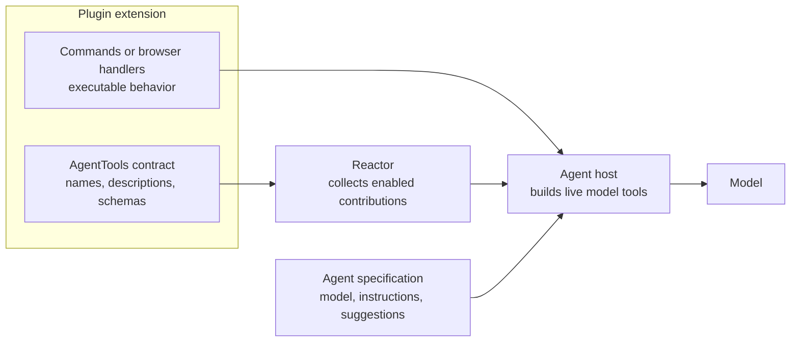
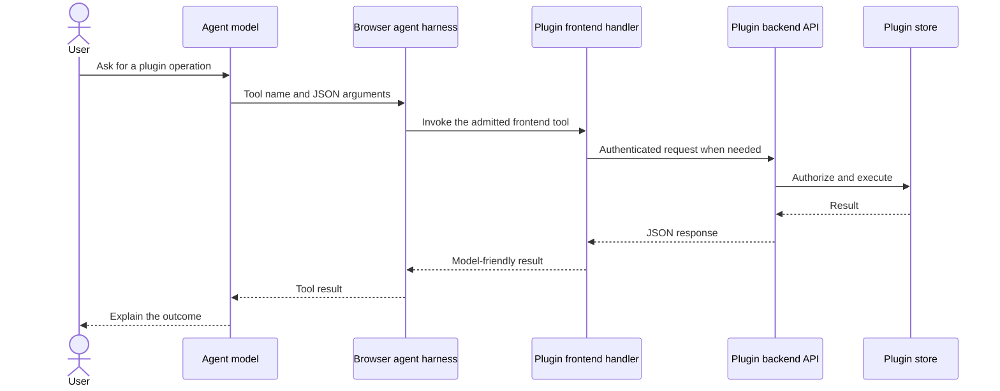
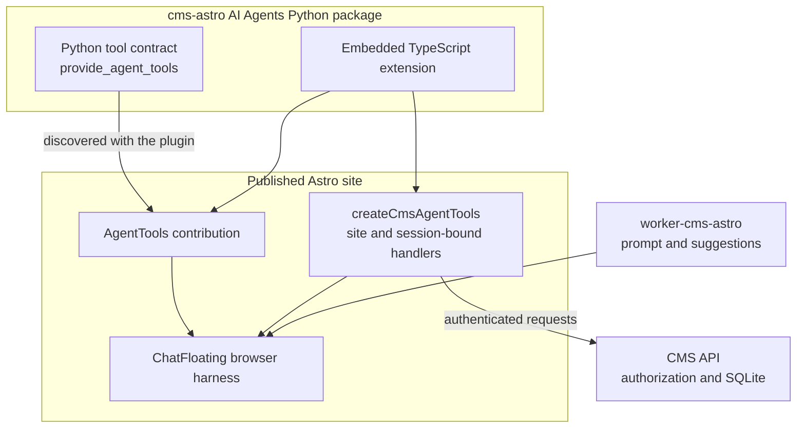
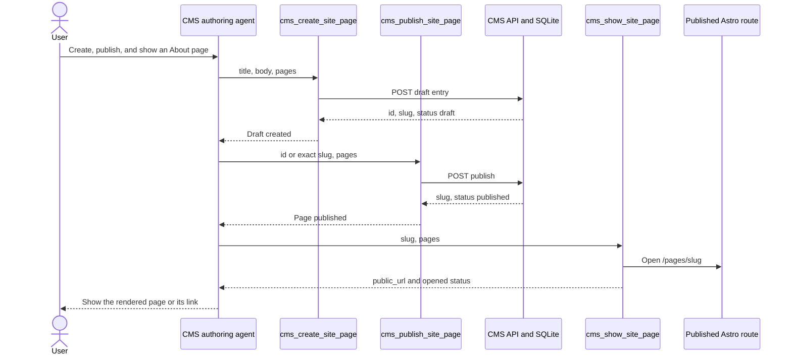

# Agent tools

A plugin's commands are what a person does from the palette or a keystroke.
The same things are what an AI agent working beside that person should be
able to do — open the deck, go to slide four, present — and the plugin is the
one that knows which of its commands make sense as tools, what to call them,
and what argument each takes. So the plugin says so, once, and every host
that wants to hand a plugin's capabilities to an agent reads one place.

The same goes for a plugin's *data*. Listing the decks, reading one, writing
a slide: each is a command too — one that takes an argument and answers with
a value — registered in the same registry, so an agent's whole reach into a
plugin arrives from the plugin, and the agent's own specification names none
of it.

Nothing about a plugin's tools lives in the agent's own specification. An
agent spec says *which plugins* it works with; what those plugins can do
arrives from the plugins themselves, and follows them wherever they are
mounted.



The plugin owns both the contract and the behavior. The agent specification
guides how and when the model uses those capabilities, but does not become a
second tool registry.

## Declaring them — TypeScript

`AgentTools` is a contribution point the reactor defines. A plugin
contributes a bundle to it; `defineAgentTools` fills the bookkeeping and
refuses a tool name a model cannot call.

```ts
import { AgentTools, contribution, defineAgentTools, definePlugin } from '@datalayer/reactor';

export const DECKS_AGENT_TOOLS = defineAgentTools({
  id: 'decks',
  name: 'Decks',
  plugin: '@datalayer/decks',
  commands: [
    { name: 'decks_next_slide', command: 'decks.nextSlide', description: 'Advance the open deck by one slide.' },
    {
      name: 'decks_open',
      command: 'decks.open',
      description: 'Open a deck by id, optionally at a slide.',
      parameters: {
        type: 'object',
        properties: { id: { type: 'string' }, slide: { type: 'integer' } },
        required: ['id'],
      },
    },
  ],
});

export const DecksPlugin = definePlugin({
  name: '@datalayer/decks',
  contributes: [contribution(AgentTools, DECKS_AGENT_TOOLS, { id: 'decks' })],
  register: ({ registerCommand }) => { /* decks.nextSlide, decks.open, … */ },
});
```

A bundle:

| Field | Meaning |
| --- | --- |
| `id`, `name`, `description` | how a list of bundles reads |
| `plugin` | the plugin these are the commands of |
| `commands[]` | one tool per command: `name` (what the model calls), `command` (the reactor command id), `description`, `parameters` (JSON Schema of the argument, passed whole; none for a command without one). What the command's `execute` returns is the tool's result |
| `toolset` | the tool names the bundle grants — every command's name unless the bundle says less |

## Reading them — a host

```ts
import { agentToolBundles } from '@datalayer/reactor';
import { useAgentToolBundles } from '@datalayer/reactor/react';

const bundles = agentToolBundles(reactor);   // or the hook, live, in a component
```

What a host does with a bundle is its business. A chat host turns each
command into a tool whose handler is `reactor.executeCommand(command, args)`
and whose result is what the command returned — `executeCommand` resolves
with the command's value, so a command that lists things answers with the
list and one that returns nothing answers that it ran. A host with a richer
implementation of some tool keeps the bundle's name and description and
supplies its own handler — the bundle is the contract with the model; the
handler is the host's. The `toolset` is the least-privilege list: a harness
that admits client tools by name admits these.



The browser handler binds the generic schema to live page state such as the
selected site and session token; the backend still performs its normal
authorization checks. A purely visual tool can stop at the handler—for
example by selecting a view or opening a route—without making an API request.

## Declaring them — Python

The Python tier has the same vocabulary. A plugin returns bundles from
`provide_agent_tools`, and the management API lists what every enabled plugin
returned, so an agent runtime can learn a plugin's tools from the server that
serves it.

```python
class DecksPlugin:
    def provide_agent_tools(self) -> list[dict]:
        return [DECKS_AGENT_TOOLS]      # the same shape as above, as a dict
```

```
GET /plugins/agent-tools
[{"id": "decks", "plugin": "decks", "toolset": ["decks_next_slide", "decks_open"], "commands": [...]}]
```

`PluginPlatform.collect_agent_tools()` is the same list in-process.

## Data as commands

A plugin's reading and writing belong in the bundle too, as commands that
return their answer. The [decks plugin](https://github.com/datalayer/datalayer-osp)
registers `decks.listDecks`, `decks.getDeck`, `decks.createDeck`,
`decks.updateSlide` and the rest beside `decks.open` and `decks.present`; each
runs on the page — against the plugin's own store, which saves to the decks
server when it was given one — and returns what the model needs next: the
list, the spec and an outline, the id of what was made. Its agent spec names
no tool at all. Keeping the data operations *in* the plugin, rather than as
callables declared beside the agent, is what lets the agent's reach follow the
plugin wherever it is mounted, and lets the two halves of the plugin ship one
bundle: the TypeScript declares it, and the Python serves the same file.

## CMS Astro: frontend tools in practice

The [`cms-astro` AI Agents extension](https://github.com/datalayer/reactor/tree/main/examples/cms-astro/ai-agents)
uses this pattern with tools whose handlers are bound to the authenticated
site in the browser:

- `cms_crawl_blog` and `cms_crawl_wordpress` read public source material;
- `cms_create_site_page` and `cms_update_site_page` write CMS content;
- `cms_publish_site_page` performs the explicit transition to published;
- `cms_show_site_page` opens the rendered Astro route for an exact slug.

The Python extension advertises the same contract through
`provide_agent_tools`. The TypeScript plugin contributes it to `AgentTools`,
while `createCmsAgentTools` supplies live functions using the current
`apiUrl`, `siteId`, and CMS session. The worker specification supplies the
model and behavior—such as requiring an explicit publish request—but declares
no duplicate tools.



Creating, publishing, and showing a page are separate tools so publication
cannot be hidden inside a visual action. The agent first creates a draft,
publishes only after an explicit request, and then opens the public route. If
the browser blocks the new tab, the show tool returns the same URL for the
agent to present as a link.


