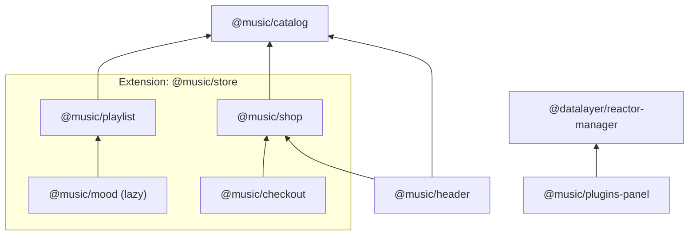

# How the music store is put together



## The plugins

- **catalog-plugin** — the base plugin. Exposes the `useCatalogSongs` data hook
  and a `catalog` slot UI. Ships the `music-catalog-plugin` Python package — a
  reactor plugin (manifest name `catalog`) serving `GET /api/catalog/songs`.
- **header-plugin** — declares `dependencies: [CatalogPlugin, ShopPlugin]` and
  consumes `useCatalogSongs` plus the shared cart store. Contributes the store
  header to the `header` slot, including a cart summary that reveals cart details
  in an overlay on hover. It *offers* a `cart-actions` slot inside that overlay
  and does not know or care who fills it — which is why it does not depend on the
  checkout plugin.
- **shop-plugin** — declares `dependencies: [CatalogPlugin]`. Owns the shared
  `useCart` store and contributes the purchasable song cards plus cart to the
  `main` slot, offering the same `cart-actions` slot underneath them.
- **checkout-plugin** — declares `dependencies: [ShopPlugin]` and consumes the
  shared cart store. Contributes everything it owns and exports nothing for
  another plugin to draw: `CheckoutButton` to `cart-actions`, `CheckoutPage` to
  `checkout`, and `CheckoutAside` to `checkout-aside`.
- **playlist-plugin** — the plugin that **offers a contribution point**. It owns
  a playlist view and opens `music.playlistRule` for other plugins to fill; it
  ships no rules itself, so on its own it renders a playlist that says so.
- **mood-plugin** — the plugin that **uses** that point. It declares
  `dependencies: [PlaylistPlugin]` and contributes three rules (Chill, Energetic,
  A to Z); it contributes to no slot and renders nothing of its own.
- **plugins-panel-plugin** — contributes the Python plugins as a group in the
  [plugins manager](/plugins/manager), driven by `GET /plugins` and
  `POST /plugins/{name}/toggle`.

Every plugin, on both tiers, declares a `displayName`/`display_name`,
`description`, `octicon` and `emoji`. That is why one overlay draws either.

## The checkout plugin is the one to untick first

The header used to `import` the checkout button and render it itself, so
switching this plugin off left a button that opened a page that was no longer
there.

Now the header and the shop each **offer** a `cart-actions` slot and the checkout
plugin fills both, so unticking it removes the button from the overlay *and* from
under the songs, and the rest of the store carries on.

Nothing depends on it any more, which is why the app mounts it deliberately in
`StoreExtension` — a capability of the store, not an implementation detail of its
header.

## Two plugins, one contribution point

`playlist-plugin` and `mood-plugin` exist to show the shape a slot cannot
express. A **slot** answers *"render everything plugins put here"*. A
**contribution point** answers a different question: *"what do plugins offer, so
the application can choose?"* — here, a set of ways to fill a playlist, of which
one is on screen at a time.

- The playlist plugin **declares** the point and hosts it. It reads the
  contributions with `useContributions(PlaylistRulePoint)`, draws a chooser from
  them, and applies the chosen rule to the catalog.
- The mood plugin **contributes** to it, declaratively:

  ```ts
  contributes: [
    contribution(PlaylistRulePoint, CHILL, { id: 'chill', order: 0 }),
    …
  ]
  ```

Nothing points from the playlist plugin to the mood plugin. That is what makes
this a contribution point rather than an import: a fourth plugin can add a rule
tomorrow without the playlist plugin changing.

The same relationship exists on the Python side, between the `playlist` and
`mood` backend plugins, over `music.playlistRule`.

## Loaded after the first paint

`@music/mood` is mounted with `defineLazyPlugin`, so its module is fetched
*after* the platform starts rather than before the first paint:

```ts
const MoodPlugin = defineLazyPlugin({
  name: '@music/mood',
  displayName: 'Moods',
  octicon: 'sun',
  emoji: '🌤️',
  dependencies: [PlaylistPlugin],
  activationEvents: [onContributionPoint('music.playlistRule')],
  load: () => import('@datalayer-examples/reactor-music-mood-plugin')
    .then(module => module.MoodPlugin),
});
```

The store and an empty playlist render immediately; the playlist asks what rules
exist, and *that read* fetches the module. Nobody had to name this plugin to
cause it.

It is a fair candidate for laziness precisely because it renders no UI of its
own — its absence costs a chooser, not a page. Everything the sidebar needs to
list and describe it is declared on the reference rather than inside the module,
so it appears in the plugin list from the first frame with a `loading…` marker
rather than popping into existence when its module arrives.

## The application, in full

The app is purely declarative. It mounts plugins, renders slots, and asks the
slots what is in them so the layout can adapt when one is switched off:

```tsx
const hasShop = useSlotComponents('main').length > 0;
```

With the shop off there is no first column, and what is left takes the whole
width rather than sitting beside a hole.
