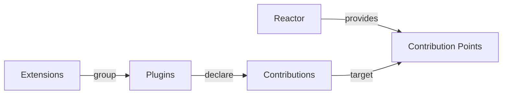

# ⚛️ Reactor

Application builders hit a wall when a feature spans the browser and the
server: frontend and backend plugin systems usually disagree about discovery,
dependencies, lifecycle, compatibility, and enablement. Teams duplicate those
contracts, hard-wire optional features into the host, and must coordinate
rebuilds and deployments just to add, remove, or replace one capability.

Reactor gives JavaScript frontends and Python backends one extensibility model,
inspired by VS Code, Eclipse (OSGi), and other proven plugin systems.

Reactor ships two sibling packages:

| Package | Language | What it is |
| --- | --- | --- |
| `@datalayer/reactor` | TypeScript | A plugin runtime with a framework-agnostic core and a separate React integration. |
| `datalayer_reactor` (imported as `reactor`) | Python | A FastAPI + pluggy plugin platform for modular extensibility. |

Both tiers implement the **same architecture**, and that is the point of
writing it down once: a host that lists, describes, groups or draws plugins
should never have to ask which side of the wire a plugin came from.

## Start here

- [Why Reactor](/overview/why) — what this targets that a hook callback does not.
- [Architecture](/overview/architecture) — the nine constructs, and the five
  diagrams that fix how they relate.
- [Get started in TypeScript](/getting-started/typescript) or
  [in Python](/getting-started/python).
- [The music example, running on this page](/examples/music/demo) — a store
  assembled entirely from plugins, with a checkbox per plugin.
- [The extensible CLI](/python-plugins/cli) and [the extensible REPL](/python-plugins/repl) —
  a command line and an interactive session whose commands come from
  installed plugins; the Datalayer CLI and the agent-runtimes terminal run
  on them.
- [The MCP server](/mcp-server/) — an MCP endpoint whose tools come from
  installed plugins, where one extension can narrow another's tool and the
  URL picks which toolsets a client gets.

## The shape of it, in one diagram

Reactor provides the contribution point; a plugin targets it. Nothing on the
Reactor side names the plugin, which is what lets a plugin be added, removed or
replaced without the host knowing.

## Everything in this documentation

import DocCardList from '@theme/DocCardList';

<DocCardList />
