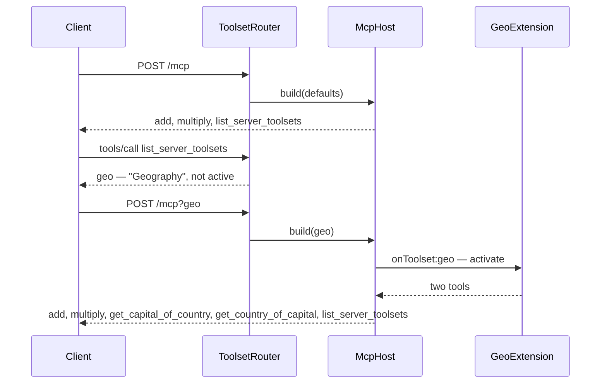

# Two toolsets, start to served

[`examples/toolsets`](https://github.com/datalayer/reactor/tree/main/examples/toolsets)
is one distribution carrying two extensions, each declaring one toolset. How
to run it, and what each file holds, is on [its examples page](/examples/toolsets/).

| Toolset | Tools | Served |
| --- | --- | --- |
| `math` | `add`, `multiply` | To everybody — on by default, with instructions |
| `geo` | `get_capital_of_country`, `get_country_of_capital` | To a client that asks — `?geo` — and not woken until one does |

## A toolset on by default

```python
from mcp.types import ToolAnnotations
from reactor import PluginManifest
from reactor_mcp_server import McpExtension, Toolset, tool

PURE = ToolAnnotations(
    read_only_hint=True, destructive_hint=False, idempotent_hint=True, open_world_hint=False
)


class MathExtension(McpExtension):
    def manifest(self) -> PluginManifest:
        return PluginManifest(name="math", version="0.1.0")

    def toolsets(self):
        return (
            Toolset(
                name="math",
                title="Math",
                description="Add and multiply numbers.",
                instructions="Use the math tools for arithmetic instead of computing in your head.",
            ),
        )

    @tool(title="Add", annotations=PURE)
    async def add(self, a: float, b: float) -> float:
        """Add two numbers and return the sum."""
        return a + b

    @tool(title="Multiply", annotations=PURE)
    async def multiply(self, a: float, b: float) -> float:
        """Multiply two numbers and return the product."""
        return a * b
```

Nothing about activation: the extension is registered when the host starts,
and a client leaves the toolset out with `?without=math`. Its instructions
reach every session that has it.

## A toolset nobody gets unless they ask

```python
from reactor_mcp_server import on_toolset


class GeoExtension(McpExtension):
    def manifest(self) -> PluginManifest:
        return PluginManifest(
            name="geo",
            version="0.1.0",
            activation_events=[on_toolset("geo")],
        )

    def toolsets(self):
        return (
            Toolset(
                name="geo",
                title="Geography",
                description="Look up the capital of a country, or the country of a capital.",
                default=False,
            ),
        )

    @tool(title="Get Capital of Country", annotations=LOOKUP)
    async def get_capital_of_country(self, country: str) -> str:
        """Return the capital city of a country, by the country's English name."""
        ...
```

Two things make it opt-in, and they do different jobs. `default=False` keeps
its tools off a bare `/mcp`. The activation event keeps the extension itself
asleep until a URL names `geo`: before that it has contributed nothing and
costs nothing, though `/toolsets` still lists it, read from the extension's
declaration, so a client can find the name to ask for.

## Published by installing

```toml
[project.entry-points."reactor.mcp.extensions"]
math = "reactor_toolsets_example.math:extension"
geo = "reactor_toolsets_example.geo:extension"
```

```bash
pip install -e "examples/toolsets[server]"
reactor-mcp-server --port 4040
```

| URL | Tools |
| --- | --- |
| `/mcp` | `add`, `multiply`, `list_server_toolsets` |
| `/mcp?geo` | the above, and the two `geo` tools |
| `/mcp?only=geo` | the `geo` tools, and `list_server_toolsets` |



Over stdio the command line selects instead of a URL:

```bash
reactor-mcp-server --transport stdio --toolsets geo
```

## A real one

The same shape serves [NASA Earthdata](https://github.com/datalayer/earthdata-mcp-server):
the `earthdata` extension declares an opt-in toolset, and installing
`earthdata-mcp-server` beside any host serves it at `/mcp?earthdata`.
