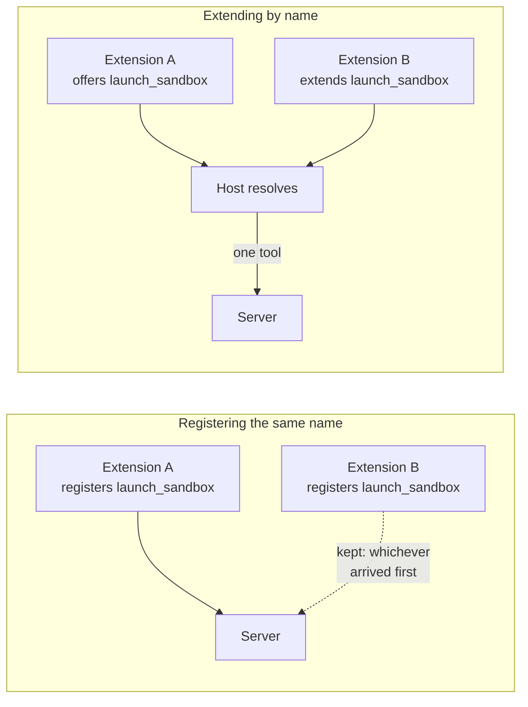
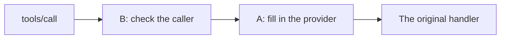

# Extending another extension's tool

An extension that wanted to narrow somebody else's tool used to have exactly
one lever: register a tool of the same name and hope to run **second**,
because the MCP SDK keeps the first registration of a name and warns. Whether
it worked depended on the order two distributions happened to load in — it
worked where the entry-point names sorted the right way and silently did
nothing where they did not.



An extension says what it does to which tool, and the host applies it:

```python
from reactor_mcp_server import McpExtension, ToolExtension


class OnDatalayer(McpExtension):
    def tool_extensions(self):
        def narrow(original):
            async def launch_sandbox(sandbox_name: str, environment: str = "ai-env"):
                """Launch a sandbox on this platform."""
                return await original(sandbox_name, variant="datalayer",
                                      environment=environment)

            return launch_sandbox

        return (
            (
                "launch_sandbox",
                ToolExtension(
                    wrap=narrow,
                    description="Launch a sandbox on this platform.",
                ),
            ),
        )
```

## What a `ToolExtension` may change

Three things, and nothing else — a fourth would be the extension *replacing*
the tool rather than extending it:

| Field | What it does |
| --- | --- |
| `wrap` | Takes the handler, answers another one: a check before, a shape after, an argument the wrapper fills in. |
| `description` / `title` | Replace what a model reads, for an extension that narrows a tool and should say so. |
| `annotations` | Replace the tool's, for a deployment where the same tool is, say, no longer read-only. |
| `meta` | Merged over the tool's own, so an extension can carry a policy the host reads without the tool knowing it exists. |

A field left `None` keeps what the tool said. That asymmetry is the useful
one: a narrowing that asks for a *name* where the original asked for a path
says something different about its arguments and nothing different about what
the tool does, so it replaces the description and keeps the annotations.

## Order

Extensions of one tool are applied in the order the host reads them —
contribution `order` first, then the order they were contributed — so two
extensions of the same tool compose the same way on every machine. The
**outermost** wrapper is the last one applied, which is what an extension
adding a check expects: its check runs first, and the tool it guards runs
last.



## Extending a tool nobody offered

Not an error. The extension is stored, never applies, and the host can say so
when asked. An extension installed before the thing it extends — or beside a
deployment that does not carry it at all — is an ordinary state, not a
failure:

```python
platform.get_contribution_extensions(TOOLS, "launch_sandbox")   # [] if absent
```

This is what makes an extension safe to ship for a tool that is optional
somewhere: it narrows the tool where it exists, and costs nothing where it
does not.

## Replacing, not only wrapping

`wrap` receives the original and need not call it. An extension whose answer
comes from somewhere else entirely returns a handler that ignores it:

```python
def replace_list_notebooks(_original):
    return list_notebooks_from_the_platform
```

Still declared as an extension *of* the tool, because the name is the one an
agent reaches for. A second tool under another name would be found after the
first one had already answered "you have none".
