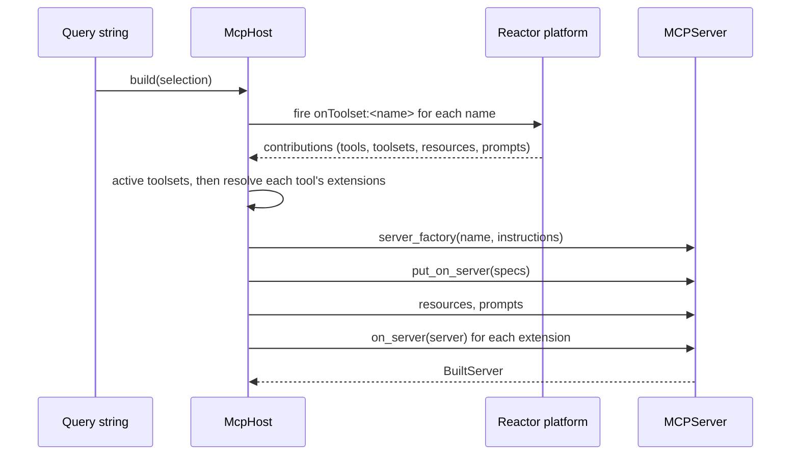

# The host

`McpHost` owns a reactor platform, the extensions registered on it, and the
servers built from them. Everything interesting happens here rather than in
the extensions — which toolsets are on, which extensions of a tool apply, what
a client ends up seeing — because that is the part that changes per request
while the extensions stay the same.

```python
from reactor_mcp_server import build_host, load_extensions

host = build_host(load_extensions(), name="my-server")
built = host.build()
```

`build_host` registers the extensions and starts the platform. `load_extensions()`
reads the entry-point group; a list of instances works just as well, which is
what a test does.

## Building a server

```python
from reactor_mcp_server import parse_selection

built = host.build(parse_selection("only=spaces"))
built.server        # the MCPServer to serve
built.toolsets      # frozenset of the toolsets that are on
built.tool_names    # what a client will list
built.unknown       # names the URL used that nobody declared
```

A `BuiltServer` carries what it was built from, because "which tools am I
getting and why" is the question a hosted endpoint is asked most, and
answering it from the built server alone means reading the SDK's registry and
guessing.



Servers are cached per selection, keyed on the *set* of active toolsets: `?a&b`
and `?b&a` are one server, and so are `?a` and `?toolsets=a`. Building one
means walking every contribution and wrapping every handler, so two clients
asking for the same toolsets share the result. `forget_built()` drops the
cache — after enabling or disabling a plugin.

## What a deployment decides

### The server a selection is served by

`McpHost.build` makes an `MCPServer`. A deployment that serves a subclass —
one carrying CORS, an authentication middleware, the token verifier an
operator configured — says so:

```python
def make_server(name, instructions):
    server = MyServerWithCORS(name=name, instructions=instructions)
    server._token_verifier = verifier
    return server


host = build_host(extensions, name="my-server", server_factory=make_server)
```

A selection is served by the server built for it, so that subclass has to be
what `build` makes rather than something wrapped around it afterwards. A built
server made without the verifier would be an unauthenticated door beside an
authenticated one, at the same URL.

### What else is on it

`on_server(server)` is the escape hatch, and deliberately a narrow one.
Everything an extension *offers* goes through the contribution points, where a
host can read it without running anything; this is for what an extension has
to do **to** a built server — take off a tool that was registered outside the
contribution model, add something the SDK exposes that a spec does not
describe:

```python
class Spaces(McpExtension):
    def on_server(self, server) -> None:
        for name in ("list_files", "list_kernels", "connect_to_jupyter"):
            server.remove_tool(name)
```

Called once per built server, after the tools, resources and prompts are on
it, in contribution order. A server is built per set of toolsets, so an
extension whose toolset is not active is not called.

## Reading what is on offer

Without building anything:

```python
host.declared_toolsets()        # every toolset, once each
host.offered_tools()            # every tool, extensions applied
host.offered_tools(["spaces"])  # only that toolset's
```

## When an extension misbehaves

One plugin never breaks the rest, and the failure is never silent:

- a tool whose extension raises is **left out** rather than served
  half-extended — an extension that narrows a tool and fails to would
  otherwise widen it;
- a resource or prompt that fails to register costs that one;
- an `on_server` that raises costs that extension's action;
- an extension that fails to load at all costs that extension.

Each is logged with the plugin that caused it.
