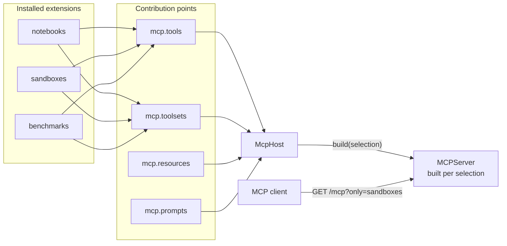

# An extensible MCP server

`reactor_mcp_server` is a foundation for building [Model Context
Protocol](https://modelcontextprotocol.io) servers out of plugins. A
deployment adds tools by installing a distribution; nothing in the server is
edited, and nothing in the server names what is installed.

It is a reactor plugin package, and an MCP extension **is** a reactor plugin:
the tools, toolsets, resources and prompts it offers are ordinary
[contributions](/python-plugins/contribution-points) at four contribution
points, so what a server is made of can be listed, grouped and drawn before
anything is built.

```bash
pip install reactor_mcp_server
```

## Three ideas

**A tool is a contribution.** An extension does not reach into a server object
and register a function on it. It *offers* a `ToolSpec`, and the host builds a
server from what has been offered. See [Tools](/mcp-server/tools).

**A contribution can be extended.** An extension may narrow, wrap or
re-describe a tool that *another* extension offered, by name and in a declared
order. See [Extending a tool](/mcp-server/extending-a-tool).

**The URL decides what is served.** Tools belong to named toolsets, and a
client says which ones it wants in the URL it connects to. See
[Toolsets](/mcp-server/toolsets).



## The smallest server that works

```python
from reactor import PluginManifest
from reactor_mcp_server import McpExtension, build_host, create_mcp_app, tool


class Notebooks(McpExtension):
    def manifest(self) -> PluginManifest:
        return PluginManifest(name="notebooks", version="1.0.0")

    @tool(title="List Notebooks")
    async def list_notebooks(self) -> list[str]:
        """Every notebook the caller can reach."""
        return ["Titanic", "Pyramid"]


app = create_mcp_app(build_host([Notebooks()], name="my-server"), path="/mcp")
```

`app` is a Starlette application: serve it with uvicorn, or mount it in one
you already have. A deployment that wants the installed extensions and no
code at all runs the module instead — see [Serving](/mcp-server/serving).

## What the pieces are called

| Construct | What it is |
| --- | --- |
| `McpExtension` | A reactor plugin that offers tools. One subclass per extension. |
| `ToolSpec` | One tool, as an extension offers it: a name, a handler, what a model reads. |
| `ToolExtension` | What one extension does to another extension's tool. |
| `Toolset` | A named group of tools, the thing a URL switches on. |
| `McpHost` | The platform, the extensions on it, and the servers built from them. |
| `BuiltServer` | A server and what it was built from — so a host can say *why* these tools. |
| `ToolsetRouter` | The ASGI application that reads the URL and routes to the right built server. |

## Where to go next

- [Tools](/mcp-server/tools) — offering one, and what a client sees.
- [Extending a tool](/mcp-server/extending-a-tool) — narrowing somebody else's.
- [Toolsets](/mcp-server/toolsets) — the URL grammar, and activation.
- [The host](/mcp-server/host) — building a server, and what a deployment decides.
- [Serving](/mcp-server/serving) — over HTTP, with one endpoint and many servers.
- [Writing an extension](/mcp-server/writing-an-extension) — start to published.
