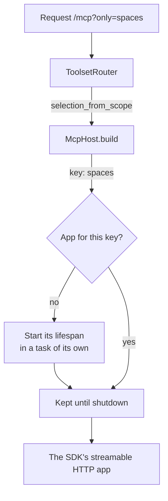

# Serving it over HTTP

One endpoint, many servers. A client connects to `/mcp` and gets the default
toolsets; a client that connects to `/mcp?benchmarks` gets those as well. The
selection is read per connection, the matching server is built once and kept,
and two clients asking for the same toolsets share it.

```python
from reactor_mcp_server import build_host, create_mcp_app, load_extensions

app = create_mcp_app(build_host(load_extensions()), path="/mcp")
```

`app` is a Starlette application. Serve it with uvicorn, or mount it in one
you already have.

## What it serves

| Route | What it answers |
| --- | --- |
| `POST /mcp` | The protocol, on the server this URL's toolsets select |
| `GET /healthz` | Whether the process is up, without opening a session |
| `GET /toolsets` | What this deployment offers and what a URL would activate |

`/toolsets` takes the same query string, so a client can ask what a connection
*would* get:

```bash
curl https://mcp.example.com/toolsets?only=spaces
```

```json
{
  "toolsets": [
    {"name": "spaces", "description": "…", "default": true, "always": false, "active": true},
    {"name": "sandboxes", "description": "…", "default": true, "always": false, "active": false}
  ],
  "active": ["spaces"],
  "tools": ["find_notebook", "list_spaces", "…"],
  "unknown": []
}
```

It is how a client is *told* which names it may put in its URL, rather than
being sent to read a deployment's source. Both extra routes can be turned off
(`healthz=None`, `toolsets_route=None`) for a deployment that serves its own.

## Running the installed extensions

A deployment that wants what is installed and no code at all runs the module:

```bash
pip install "reactor_mcp_server[server]"
reactor-mcp-server --port 4040 --path /mcp
```

| Option | Default | What it is |
| --- | --- | --- |
| `--host` / `REACTOR_MCP_HOST` | `0.0.0.0` | Interface to bind |
| `--port` / `REACTOR_MCP_PORT` | `4040` | Port |
| `--path` / `REACTOR_MCP_PATH` | `/mcp` | Where the protocol is served |
| `--name` / `REACTOR_MCP_NAME` | `reactor-mcp-server` | What the server calls itself |
| `--extension` / `REACTOR_MCP_EXTENSIONS` | every installed one | Load only these, repeatable |

Naming the extensions is what makes a tool list reproducible: the surface a
client sees is otherwise whatever happens to be installed beside the server,
so an environment carrying one extra extension answers differently from a bare
one.

## Transport options

The SDK takes them where the application is built, which the router does — so
a deployment that needs sessions says so once and every selection is served
the same way:

```python
app = create_mcp_app(host, path="/mcp", app_options={"stateless_http": False})
```

Another toolset is not another transport.

## Two things a host of the SDK's app must get right

Both are handled by `create_mcp_app`, and both are worth knowing if you build
your own router.

**Reach the app with the path the client sent.** Mounting the SDK's
application strips the prefix and redirects `/mcp` to `/mcp/` — which a client
posting JSON-RPC does not follow, so the session never starts and the endpoint
looks broken rather than misrouted. `ToolsetRouter` builds each app for the
path it serves and hands the request over unchanged.

**Run each app's lifespan.** The SDK's application starts its session manager
there, and a sub-application's lifespan is not run by the application that
routes to it: an app served without one answers every request with "Task group
is not initialized". Each lifespan runs in a task of its own, started the
first time that set of toolsets is asked for and kept until shutdown — not
opened inline in the request that first asked for it, because a cancel scope
entered in one task and left in another is an error anyio raises at the end,
on shutdown, where nobody is looking for it.


