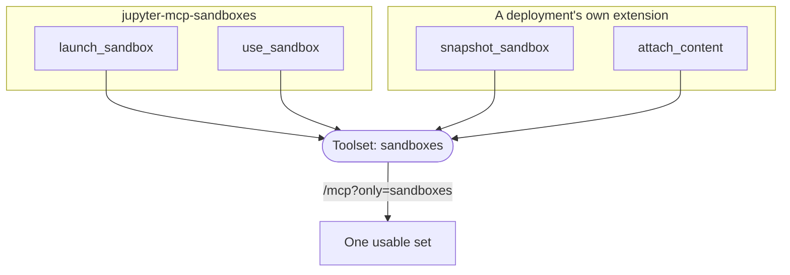

# Toolsets, and the URL that picks them

A hosted MCP server serves one endpoint to everybody, and not everybody wants
the same tools. A client that came for notebooks should not have to read past
twenty tools it will never call, and a model given every tool a deployment can
offer chooses worse than one given the tools for the job — at a cost paid on
every turn.

So tools belong to named toolsets, and the URL says which ones this client
wants:

| URL | What it gets |
| --- | --- |
| `/mcp` | The toolsets that are on by default |
| `/mcp?benchmarks` | The defaults **and** `benchmarks` |
| `/mcp?toolsets=benchmarks,spaces` | The same, for a client that builds query strings with values |
| `/mcp?only=spaces` | Only `spaces` (and any toolset declared `always`) |
| `/mcp?without=sandboxes` | The defaults, less one |

A bare flag is the spelling worth having: it is what somebody types into an
agent's configuration, and `?benchmarks` says what it means without anybody
reading a manual. A key with a value that is not one of the three reserved
ones is read as a name too, so `?benchmarks=1` does what whoever typed it
meant.

## Declaring one

```python
from reactor_mcp_server import McpExtension, Toolset


class Benchmarks(McpExtension):
    def toolsets(self) -> tuple[Toolset, ...]:
        return (
            Toolset(
                name="benchmarks",
                description="Read what a benchmark run did.",
                default=False,
            ),
        )
```

| Field | What it means |
| --- | --- |
| `name` | What a URL says. |
| `description` | What `/toolsets` tells a client. |
| `default` | On when the URL says nothing. `False` makes it opt-in. |
| `always` | On whatever the URL says — so `only=` cannot produce an endpoint nobody can use. |

An extension that declares nothing gets one toolset named after its plugin, on
by default. A tool that names no toolset goes in its extension's **first
declared** one.

## A name is a subject, not a package

Two extensions may declare the same name, and that is the point: a deployment
adding its own sandbox tools declares `sandboxes` too, and both arrive
together under one name a client can ask for.



Naming a toolset after the package that ships it splits what a client asked
for. The failure is quiet and specific: `?only=sandboxes` answers with every
tool that *needs* a sandbox and no way to launch one.

The host lists a toolset once even when several extensions declare it; the
first declaration is the one described.

## Activation: an extension that costs nothing until asked

A toolset that is opt-in usually belongs to an extension that should not even
be registered until somebody wants it. The manifest says so:

```python
from reactor import PluginManifest
from reactor_mcp_server import on_toolset


def manifest(self) -> PluginManifest:
    return PluginManifest(
        name="benchmarks",
        version="1.0.0",
        activation_events=[on_toolset("benchmarks")],
    )
```

The host fires `onToolset:<name>` for every name a URL asked for *before* it
reads the contributions, so a plugin held back until somebody wanted it is
registered, has contributed, and is in the list that build returns.

## A name nobody declared

Served anyway, and reported. A URL is written by a person configuring an
agent, and a deployment that refused the whole connection over a stale toolset
name would take a working client down over a typo:

```json
{"active": ["notebooks", "spaces"], "unknown": ["benchmrks"]}
```

The endpoint answers that at `/toolsets` — see [Serving](/mcp-server/serving) —
and logs it, which is also how a client finds out it is asking for something
that no longer exists.

## Read once per connection

MCP is a session: a client lists the tools when it opens one and works from
that list. A server that changed its tools mid-session would have clients
calling tools that are gone and never seeing the ones that are — so the
selection is read from the URL, which is the one place a client can state what
it wants before the session exists.
