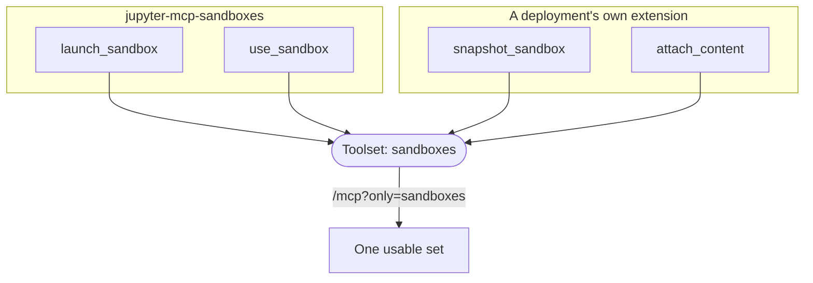

# Toolsets, and the URL that picks them

A hosted MCP server serves one endpoint to everybody, and not everybody wants
the same tools. A client that came for notebooks should not have to read past
twenty tools it will never call, and a model given every tool a deployment can
offer chooses worse than one given the tools for the job — at a cost paid on
every turn.

So tools belong to named toolsets, and the URL says which ones this client
wants:

| URL | What it gets |
| --- | --- |
| `/mcp` | The toolsets that are on by default |
| `/mcp?benchmarks` | The defaults **and** `benchmarks` |
| `/mcp?toolsets=benchmarks,spaces` | The same, for a client that builds query strings with values |
| `/mcp?only=spaces` | Only `spaces` (and any toolset declared `always`) |
| `/mcp?without=sandboxes` | The defaults, less one |

A bare flag is the spelling worth having: it is what somebody types into an
agent's configuration, and `?benchmarks` says what it means without anybody
reading a manual. A key with a value that is not one of the three reserved
ones is read as a name too, so `?benchmarks=1` does what whoever typed it
meant.

## Declaring one

```python
from reactor_mcp_server import McpExtension, Toolset


class Benchmarks(McpExtension):
    def toolsets(self) -> tuple[Toolset, ...]:
        return (
            Toolset(
                name="benchmarks",
                title="Benchmarks",
                description="Read what a benchmark run did.",
                instructions="Read a run's summary before its traces.",
                default=False,
            ),
        )
```

| Field | What it means |
| --- | --- |
| `name` | What a URL says. |
| `title` | A human-readable name for a client's UI. Empty falls back to `name`. |
| `description` | What `/toolsets` and `list_toolsets` tell a client. |
| `instructions` | What a model should know to use these tools well — added to the server's instructions only in a session that has this toolset. |
| `default` | On when the URL says nothing. `False` makes it opt-in. |
| `always` | On whatever the URL says — so `only=` cannot produce an endpoint nobody can use. |

An extension that declares nothing gets one toolset named after its plugin, on
by default. A tool that names no toolset goes in its extension's **first
declared** one.

## Instructions ride with the toolset

MCP gives a server one place to say how it should be used: the `instructions`
a client reads when it opens a session. A toolset's own instructions are added
there **only when the toolset is active**, after the host's, under the
toolset's title:

```text
Be brief.

## Benchmarks

Read a run's summary before its traces.
```

A client that did not ask for `benchmarks` does not read how to use it — the
same reason it does not list its tools.

## A name is a subject, not a package

Two extensions may declare the same name, and that is the point: a deployment
adding its own sandbox tools declares `sandboxes` too, and both arrive
together under one name a client can ask for.


```mermaid
flowchart TB
  subgraph ships["jupyter-mcp-sandboxes"]
    t1["launch_sandbox"]
    t2["use_sandbox"]
  end
  subgraph adds["A deployment's own extension"]
    t3["snapshot_sandbox"]
    t4["attach_content"]
  end
  ts(["Toolset: sandboxes"])
  t1 --> ts
  t2 --> ts
  t3 --> ts
  t4 --> ts
  ts -->|"/mcp?only=sandboxes"| client["One usable set"]
```

Naming a toolset after the package that ships it splits what a client asked
for. The failure is quiet and specific: `?only=sandboxes` answers with every
tool that *needs* a sandbox and no way to launch one.

The host lists a toolset once even when several extensions declare it; the
first declaration is the one described.

## Activation: an extension that costs nothing until asked

A toolset that is opt-in usually belongs to an extension that should not even
be registered until somebody wants it. The manifest says so:

```python
from reactor import PluginManifest
from reactor_mcp_server import on_toolset


def manifest(self) -> PluginManifest:
    return PluginManifest(
        name="benchmarks",
        version="1.0.0",
        activation_events=[on_toolset("benchmarks")],
    )
```

The host fires `onToolset:<name>` for every name a URL asked for *before* it
reads the contributions, so a plugin held back until somebody wanted it is
registered, has contributed, and is in the list that build returns.

## A name nobody declared

Served anyway, and reported. A URL is written by a person configuring an
agent, and a deployment that refused the whole connection over a stale toolset
name would take a working client down over a typo:

```json
{"active": ["notebooks", "spaces"], "unknown": ["benchmrks"]}
```

The endpoint answers that at `/toolsets` — see [Serving](/mcp-server/serving) —
and logs it, which is also how a client finds out it is asking for something
that no longer exists.

## Asking from inside a session

`/toolsets` answers a client that can make an HTTP request before it connects.
A model already in a session cannot, and a stdio client has no route to read.
`list_toolsets` is the same answer, as a tool:

```python
host = build_host(extensions, name="my-server", list_toolsets_tool=True)
```

```json
{
  "toolsets": [
    {"name": "benchmarks", "title": "Benchmarks", "description": "…", "default": false, "always": false, "active": false},
    {"name": "notebooks", "title": "Notebooks", "description": "…", "default": true, "always": false, "active": true}
  ],
  "active": ["notebooks"],
  "tools": ["list_notebooks", "list_toolsets"],
  "unknown": [],
  "how_to_select": "Reconnect with the toolset in the URL: ?name adds it, ?only=a,b asks for exactly those, ?without=name leaves one out."
}
```

It is read-only, idempotent and closed-world, and it is on every server the
host builds whatever the selection. It is off by default in code, so a
deployment's tool list does not grow a tool it did not choose; the
`reactor-mcp-server` command turns it on.

## What the deployment decides

Each toolset says whether it is on by default. A deployment can overrule that
for a URL that names nothing — one process serving an opt-in toolset to a bare
`/mcp` — and can keep query keys of its own from being read as names:

```python
from reactor_mcp_server import create_mcp_app, parse_selection

app = create_mcp_app(
    host,
    path="/mcp",
    # What `/mcp` gets. A URL that names anything is read as it says.
    default_selection=parse_selection("only=earthdata"),
    # `?scopes=data:read` is for the authorization server, not a toolset.
    ignore_query_keys=["scopes"],
)
```

The `reactor-mcp-server` command takes the same two as `--toolsets` and
`--ignore-query-key` — see [Serving](/mcp-server/serving).

## What a request is about to get

Something beside the MCP application sometimes has to know which toolsets a
request selects before any tool runs — a middleware that fetches a user's
credentials only for the requests that need them. Ask the host, without
building anything:

```python
from reactor_mcp_server.toolsets import selection_from_scope

active = host.active_for(selection_from_scope(scope))
if "odoo" in active:
    ...
```

Checking whether the name is *in the URL* answers a different question:
`?only=odoo` never names it the way `?odoo` does, a default toolset is on
without being named, and `?without=` takes one away. `active_for` applies the
same rules `build` does.

## Read once per connection

MCP is a session: a client lists the tools when it opens one and works from
that list. A server that changed its tools mid-session would have clients
calling tools that are gone and never seeing the ones that are — so the
selection is read from the URL, which is the one place a client can state what
it wants before the session exists. `list_toolsets` tells a model what else
there is; reaching it is a new connection with a new URL.

## A worked example

[`examples/toolsets`](https://github.com/datalayer/reactor/tree/main/examples/toolsets)
ships two toolsets in one wheel — `math`, on by default, and `geo`, opt-in and
not woken until asked for. See [Example toolsets](/mcp-server/example-toolsets).
