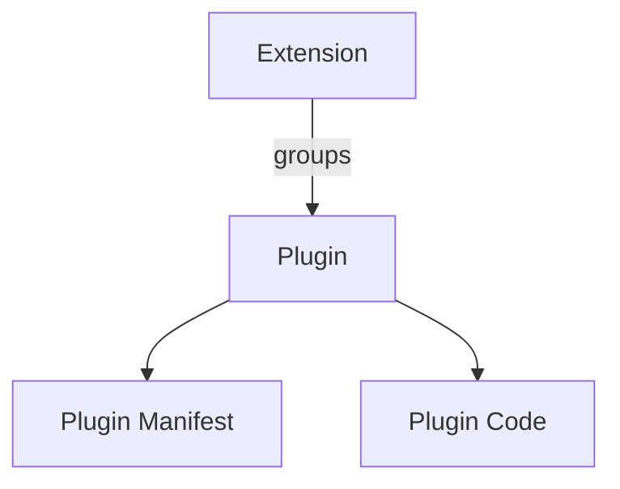
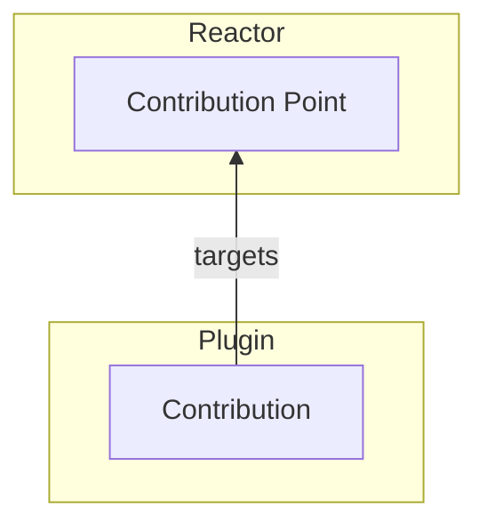
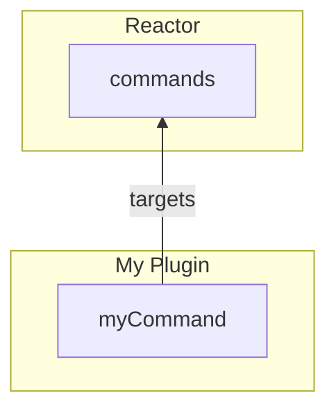
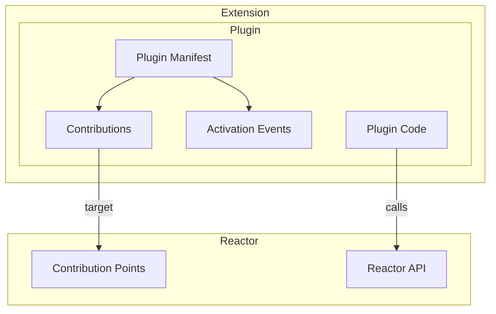
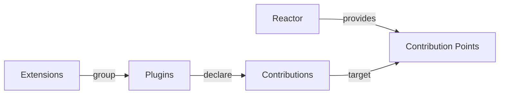

# Architecture

## Constructs

| Construct | Purpose | Relationship |
| --- | --- | --- |
| **Plugin** | Fundamental modular and installable unit | Declares Contributions and can provide executable code |
| **Plugin Manifest** | Describes the Plugin | Contains metadata, contributions, activation rules, and entry points |
| **Contribution Point** | Defines a type of functionality that can be extended | Provided by Reactor |
| **Contribution** | Concrete functionality added through a Contribution Point | Declared by a Plugin |
| **Activation Event** | Defines when a Plugin becomes active | Triggered by Reactor or by use of contributed functionality |
| **Reactor API** | Programmatic API available to Plugins | Lets Plugins interact with and extend Reactor |
| **Extension** | Groups related Plugins | Provides a higher-level installable capability |

## 1. Packaging

An extension is a wrapper. Everything that has a lifecycle is a plugin, and a
plugin is a manifest plus the code the manifest describes.

## 2. Declarative extensibility

The arrow points one way. Reactor provides the contribution point; a plugin
targets it. Nothing on the Reactor side names the plugin, which is what lets a
plugin be added, removed or replaced without the host knowing.

For example:

## 3. Complete model

The manifest is where the two halves meet: its contributions reach out to the
points Reactor provides, and its activation events say when the code behind
them should start.

Core mental model:

## What each construct is, in this codebase

| Construct | TypeScript | Python |
| --- | --- | --- |
| Plugin | `definePlugin`, `defineLazyPlugin` | `PluginManifest` + implementation |
| Plugin Manifest | `reactor.getManifest(name)` → `PluginManifest` | `PluginManifest` |
| Contribution Point | `defineContributionPoint`, `defineGate` | `define_contribution_point` |
| Contribution | `contribution(...)`, `ctx.contribute(...)` | `contributions.contribute(...)` |
| Activation Event | `activationEvents` / `deactivationEvents`, `reactor.fire(event)`, `reactor.deactivate(name)` | `activation_events` / `deactivation_events`, `platform.fire_event(event)`, `platform.deactivate_plugin(name)` |
| Reactor API | `ctx.reactor` (`ReactorPlatformView`) | `PluginPlatform` |
| Extension | `defineExtension({ plugins })` | `ExtensionManifest` + `register_extension` |

## Two distinctions the model rests on

Both are easy to lose, and losing either one costs the model its answers.

### A plugin is the unit of function; an extension is the unit of delivery

An extension has no lifecycle, contributes nothing, and cannot be enabled or
disabled. Registering one registers its plugins and records the grouping on
each plugin's manifest — after that, the platform deals only in plugins.

Grouping tells a reader *what to uninstall to lose this*; it never tells the
platform what a plugin may do. An extension that could contribute or be disabled
would be a second kind of plugin, and then every question the reactor answers
would have two answers.

### A manifest is readable without running anything

That is what lets a plugin be listed, described, drawn on the graph and switched
off while its code has never been fetched — and it is why
[activation events](/typescript/activation-events) are worth having at all.

## Repository layout

| Path | What is in it |
| --- | --- |
| `src/` | TypeScript package source for `@datalayer/reactor` |
| `reactor/` | Python package source for `datalayer_reactor` |
| `plugins/` | Reusable plugins shipped alongside the runtime — see [Bundled plugins](/plugins/) |
| `examples/` | The demos, including [the music store](/examples/music/) |
| `docs/` | This site |
