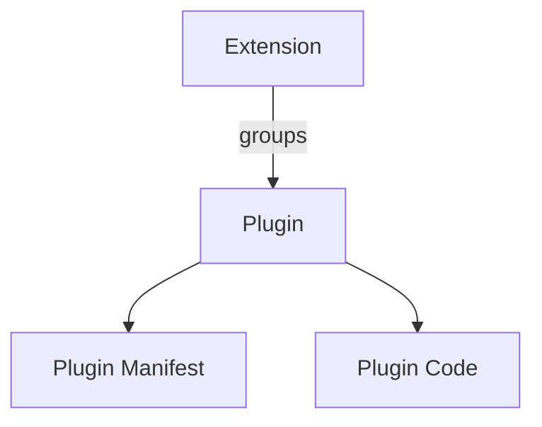
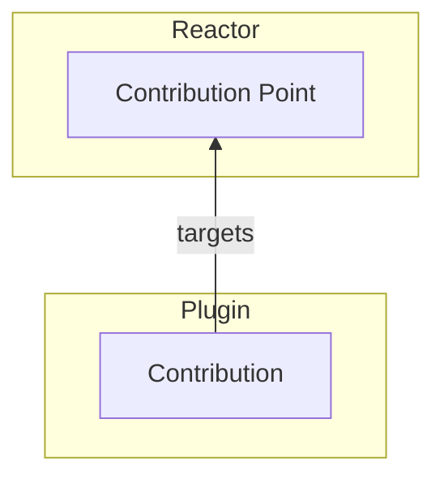
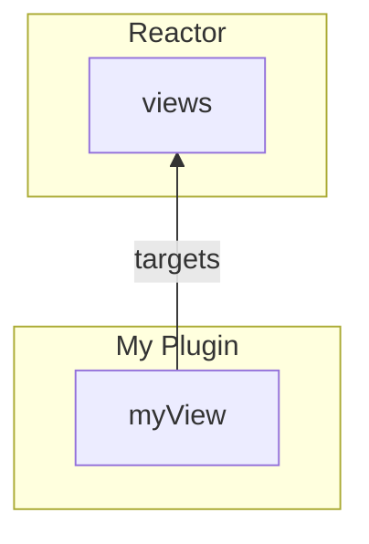
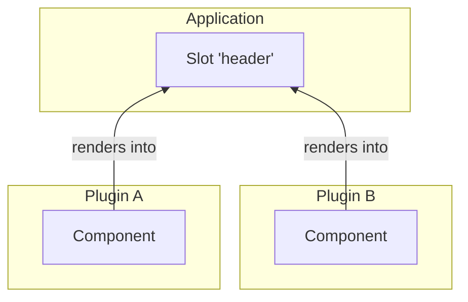
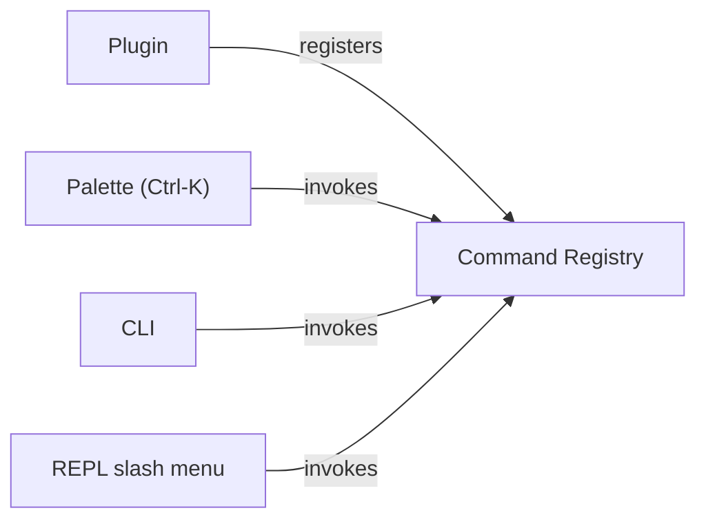
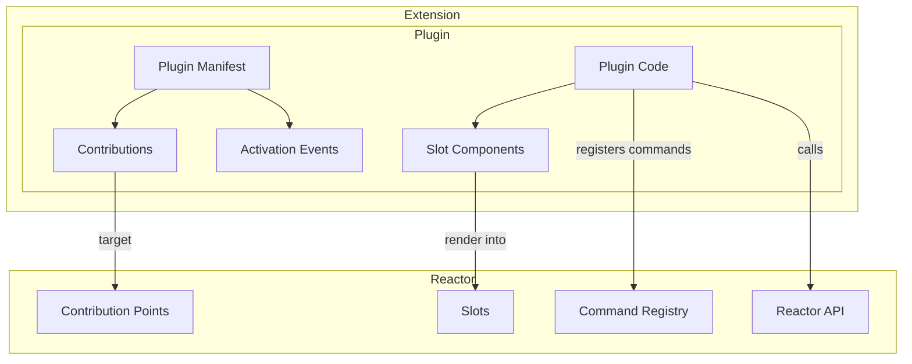
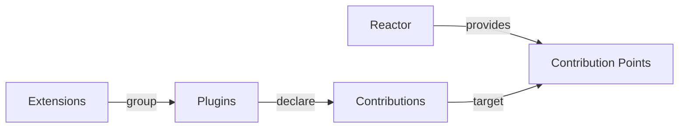

# Architecture

## Constructs

| Construct | Purpose | Relationship |
| --- | --- | --- |
| **Plugin** | Fundamental modular and installable unit | Declares Contributions and can provide executable code |
| **Plugin Manifest** | Describes the Plugin | Contains metadata, contributions, activation rules, and entry points |
| **Contribution Point** | Defines a type of functionality that can be extended | Provided by Reactor |
| **Contribution** | Concrete functionality added through a Contribution Point | Declared by a Plugin |
| **Activation Event** | Defines when a Plugin becomes active | Triggered by Reactor or by use of contributed functionality |
| **Reactor API** | Programmatic API available to Plugins | Lets Plugins interact with and extend Reactor |
| **Slot** | A named place the application renders, filled by Plugins | Plugins supply components; everything contributed is rendered |
| **Command** | Behaviour a person can invoke, registered by a Plugin | Held in the Command Registry; surfaces (palette, CLI, REPL) invoke it without interpreting it |
| **Extension** | Groups related Plugins | Provides a higher-level installable capability |

## 1. Packaging

An extension is a wrapper. Everything that has a lifecycle is a plugin, and a
plugin is a manifest plus the code the manifest describes.

## 2. Declarative extensibility

The arrow points one way. Reactor provides the contribution point; a plugin
targets it. Nothing on the Reactor side names the plugin, which is what lets a
plugin be added, removed or replaced without the host knowing.

For example:

## 3. Slots

A slot is the rendering twin of a contribution point, and the two answer
different questions. A contribution point asks *"what is on offer?"* — typed
records the application enumerates and **chooses from**. A slot asks nothing:
it is a named place in the application's chrome — a header, a toolbar, a
status bar — and **everything** plugins put there is rendered, in
contribution order. What is contributed is a component, not a record, and
nobody picks.

The arrow still points one way: the application names the slot and renders
it (`ReactorSlot`), the plugin supplies components against that name in its
build output, and neither knows the other. Choosing between a slot and a
contribution point is its own decision —
[Slots or contribution points?](/overview/slots-vs-contribution-points) is
the page for it.

## 4. Commands

A command is the third way a plugin adds something, and it is neither a
contribution nor a component. A contribution is *data the host reads and
interprets*; a command is **behaviour the host invokes without
interpreting it** — a named thing a person can run, carrying its own label,
description, icon and keybinding, so a surface can offer it before anything
executes.

Commands live in a **registry** rather than a contribution point, because
every surface would otherwise reimplement the same three jobs: looking one
up, running it (sync or async, with errors caught), and dropping the ones
whose plugin went away. Plugins register; the surfaces — a Ctrl-K palette in
the browser, a `reactor commands` call in a terminal, a slash menu in a REPL
— all invoke the same registry and none is special.

The registry is documented on [Commands Registry](/commands-registry); the
palette that draws it is the
[commands core plugin](/core-plugins/commands), and the terminal surfaces
are the [Extensible CLI](/python-plugins/cli) and
[Extensible REPL](/python-plugins/repl).

## 5. Complete model

The manifest is where the two halves meet: its contributions reach out to the
points Reactor provides, and its activation events say when the code behind
them should start.

Core mental model:

## What each construct is, in this codebase

| Construct | TypeScript | Python |
| --- | --- | --- |
| Plugin | `definePlugin`, `defineLazyPlugin` | `PluginManifest` + implementation |
| Plugin Manifest | `reactor.getManifest(name)` → `PluginManifest` | `PluginManifest` |
| Contribution Point | `defineContributionPoint`, `defineGate` | `define_contribution_point` |
| Contribution | `contribution(...)`, `ctx.contribute(...)` | `contributions.contribute(...)` |
| Activation Event | `activationEvents` / `deactivationEvents`, `reactor.fire(event)`, `reactor.deactivate(name)` | `activation_events` / `deactivation_events`, `platform.fire_event(event)`, `platform.deactivate_plugin(name)` |
| Slot | `ReactorSlot`, components in build output (`{ slot, id, Component }`) | — (a rendering concept; the Python tier serves no UI) |
| Command | `commands:` on the plugin, `ctx.registerCommand`, `reactor.executeCommand(id)` | `CommandRegistry` via `provide_slash_commands`; `reactor.slash` for REPL commands |
| Reactor API | `ctx.reactor` (`ReactorPlatformView`) | `PluginPlatform` |
| Extension | `defineExtension({ plugins })` | `ExtensionManifest` + `register_extension` |

## Two distinctions the model rests on

Both are easy to lose, and losing either one costs the model its answers.

### A plugin is the unit of function; an extension is the unit of delivery

An extension has no lifecycle, contributes nothing, and cannot be enabled or
disabled. Registering one registers its plugins and records the grouping on
each plugin's manifest — after that, the platform deals only in plugins.

Grouping tells a reader *what to uninstall to lose this*; it never tells the
platform what a plugin may do. An extension that could contribute or be disabled
would be a second kind of plugin, and then every question the reactor answers
would have two answers.

### A manifest is readable without running anything

That is what lets a plugin be listed, described, drawn on the graph and switched
off while its code has never been fetched — and it is why
[activation events](/typescript-plugins/activation-events) are worth having at all.

## Repository layout

| Path | What is in it |
| --- | --- |
| `src/` | TypeScript package source for `@datalayer/reactor` |
| `reactor/` | Python package source for `datalayer_reactor` |
| `plugins/` | Reusable plugins shipped alongside the runtime — see [Core Plugins](/core-plugins/) |
| `examples/` | The demos, including [the music store](/examples/music/) |
| `docs/` | This site |
