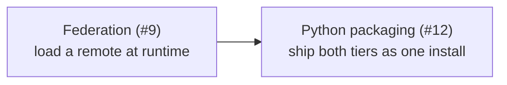

# Roadmap

What is documented elsewhere on this site exists and runs. What is here does
not — yet. Each page states the problem, what the current model already gives
it, and what is still missing, so that a reader can tell the difference between
*"Reactor does this"* and *"Reactor is going to".*

| Planned | Tracking | In one line |
| --- | --- | --- |
| [Loading extensions via federation](/roadmap/federation) — *runtime loading [shipped](/typescript-plugins/federation)* | [#9](https://github.com/datalayer/reactor/issues/9) | plugins delivered as remotes at runtime, not bundled at build time |
| [Frontend + backend extensions as one Python package](/roadmap/python-packaged-extensions) — *packaging and discovery [shipped](/python-plugins/packaging)* | [#12](https://github.com/datalayer/reactor/issues/12) | one `pip install` delivering both halves of an extension |

Shipped work leaves this page and lives with the rest of the documentation:
cross-tier activation and deactivation is under
[Lifecycle](/typescript-plugins/lifecycle) and
[Cross-tier Dependencies](/cross-tier-dependencies), and the second design
system is [the CMS example](/examples/cms/).

## How these fit together

The two remaining pieces are one theme from different sides: **a plugin should
be installable by somebody who is not building the application.**

Today a frontend plugin is an npm dependency of the shell: it is chosen at build
time, and adding one means rebuilding. [Federation](/roadmap/federation) is what
makes a plugin arrive at runtime;
[packaging](/roadmap/python-packaged-extensions) is what makes it arrive with
its server half. The third leg — the pair behaving as one thing once it has
arrived — is already there: switching a plugin
[carries to its dependants, across the wire](/cross-tier-dependencies).
