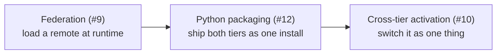

# Roadmap

What is documented elsewhere on this site exists and runs. What is here does
not — yet. Each page states the problem, what the current model already gives
it, and what is still missing, so that a reader can tell the difference between
*"Reactor does this"* and *"Reactor is going to".*

| Planned | Tracking | In one line |
| --- | --- | --- |
| [Loading extensions via federation](/roadmap/federation) — *runtime loading [shipped](/typescript/federation)* | [#9](https://github.com/datalayer/reactor/issues/9) | plugins delivered as remotes at runtime, not bundled at build time |
| ~~Cross-tier activation and deactivation~~ — **shipped**, see [deactivation](/typescript/deactivation) and [across the tiers](/cross-tier/declaring-dependencies) | [#10](https://github.com/datalayer/reactor/issues/10) | switching a plugin should carry to its dependants, and across the wire |
| [Frontend + backend extensions as one Python package](/roadmap/python-packaged-extensions) — *packaging and discovery [shipped](/python/packaging)* | [#12](https://github.com/datalayer/reactor/issues/12) | one `pip install` delivering both halves of an extension |
| ~~shadcn/ui examples~~ — **shipped** as [the CMS example](/examples/cms/) | [#11](https://github.com/datalayer/reactor/issues/11) | the same store, on a second design system |

## How these fit together

Three of the four are the same theme from different sides: **a plugin should be
installable by somebody who is not building the application.**

Today a frontend plugin is an npm dependency of the shell: it is chosen at build
time, and adding one means rebuilding. [Federation](/roadmap/federation) is what
makes a plugin arrive at runtime;
[packaging](/roadmap/python-packaged-extensions) is what makes it arrive with its
server half; [cross-tier activation](/roadmap/cross-tier-activation) is what
makes the pair behave as one thing once it has.

The fourth, [shadcn/ui](/roadmap/shadcn-ui), is a different kind of claim: that
the plugin model is independent of the UI kit the contributions happen to be
written in. The only way to demonstrate that is to write the same store twice.
