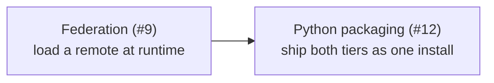

# Roadmap

What is documented elsewhere on this site exists and runs. What is here does
not — yet. Each page states the problem, what the current model already gives
it, and what is still missing, so that a reader can tell the difference between
*"Reactor does this"* and *"Reactor is going to".*

There is nothing on this page at the moment. Shipped work leaves it and lives
with the rest of the documentation:

| Shipped | Where it lives now |
| --- | --- |
| Plugins delivered as remotes at runtime — plain modules and Module Federation containers, with negotiated sharing and hot updates ([#9](https://github.com/datalayer/reactor/issues/9)) | [Federation](/federation) and [Remote plugins](/typescript-plugins/federation) |
| One `pip install` delivering both halves of an extension, the frontend as a container built into the wheel ([#12](https://github.com/datalayer/reactor/issues/12)) | [Python-packaged extensions](/python-packaged-extensions) and [Packaging an extension](/python-plugins/packaging) |
| Cross-tier activation and deactivation | [Lifecycle](/typescript-plugins/lifecycle) and [Cross-tier Dependencies](/cross-tier-dependencies) |
| A second design system | [The CMS example](/examples/cms/) |

## What is still open

One question, and it is a design question rather than a missing feature:
**trust**. A remote runs in the shell's origin with the shell's privileges.
`allowedOrigins` is the floor — nothing loads from an origin the host did not
name — but what a marketplace listing must assert before a host will load it,
and how a host verifies it, is not decided. Both design pages record it under
their open items.

## How the pieces fit together

[Federation](/federation) is what makes a plugin arrive at runtime;
[packaging](/python-packaged-extensions) is what makes it arrive with its
server half. The third leg — the pair behaving as one thing once it has
arrived — is switching a plugin
[carrying to its dependants, across the wire](/cross-tier-dependencies).
