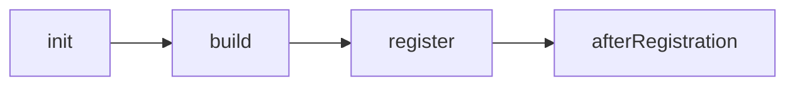

# Lifecycle

## The four phases

Plugins run in dependency order through four ordered phases:



| Phase | What belongs in it |
| --- | --- |
| `init` | reading configuration; nothing that needs another plugin's output |
| `build` | producing this plugin's output — a service, a store, a connection |
| `register` | contributing, now that every dependency has built |
| `afterRegistration` | work that needs the whole registry to exist |

`register` and `afterRegistration` may return a disposer, which is what
`disable`, `deactivate` and `stop` run.

## Turning plugins on and off at runtime

`enable` and `disable` are not restart-only switches. Disabling a plugin
disposes everything it contributed, and any host reading through
`useContributions` or `ReactorSlot` updates immediately — a view leaves the
switcher, a command leaves the palette, without the application tracking
anything.

```ts
reactor.disable('@app/notebook');
reactor.getContributions(ViewTypePoint); // the notebook view is gone
reactor.enable('@app/notebook');
reactor.getContributions(ViewTypePoint); // and back
```

This is what makes a plugin checkbox honest: the list of plugins comes from
`reactor.listPlugins()`, the state from `reactor.isEnabled(name)`, and the UI
that follows is one `useSyncExternalStore` away.

```tsx
function PluginToggles() {
  const reactor = useReactorPlatform();
  useSyncExternalStore(reactor.subscribe, reactor.getRevision);

  return (
    <ul>
      {reactor.listPlugins().map(name => (
        <li key={name}>
          <label>
            <input
              type="checkbox"
              checked={reactor.isEnabled(name)}
              onChange={event =>
                event.target.checked ? reactor.enable(name) : reactor.disable(name)
              }
            />
            {name}
          </label>
        </li>
      ))}
    </ul>
  );
}
```

You rarely have to write that: [`@datalayer/reactor-manager`](/plugins/manager)
is exactly this list, as a plugin.

## Plugins that own something say so

`enable()` re-runs `init` and `build`, which is right for a plugin that only
contributes records — it comes back clean. It is wrong for one that owns a
connection, a kernel or a cache: the fresh build returns a new instance while
everything holding the previous one is quietly detached.

```ts
definePlugin({
  name: '@app/sandbox',
  preserveOutput: true,   // keep what I built across disable/enable
  build() {
    return { sandbox: createSandboxService() };   // a live connection
  },
});
```

With `preserveOutput`, enabling a plugin that has already built keeps its output
and only re-runs `register` — so its contributions come back while the thing it
owns stays where it was. A stateless plugin needs none of this and can be
toggled freely.

## Disposal, in one place

| What happens | What the reactor does |
| --- | --- |
| `disable(name)` | runs the plugin's `register` / `afterRegistration` disposers, then drops every contribution it made |
| `enable(name)` | re-runs `init`, `build`, `register` — a fresh build output |
| `deactivate(name)` | the same, plus its dependants first — but it may activate again |
| `stop()` | disposes every plugin in reverse dependency order |
| a disposer returned by `ctx.contribute(...)` | removes that one contribution; idempotent |

Every one of these bumps the revision exactly once, so a plugin contributing
five views during `register` wakes subscribers once rather than five times.
